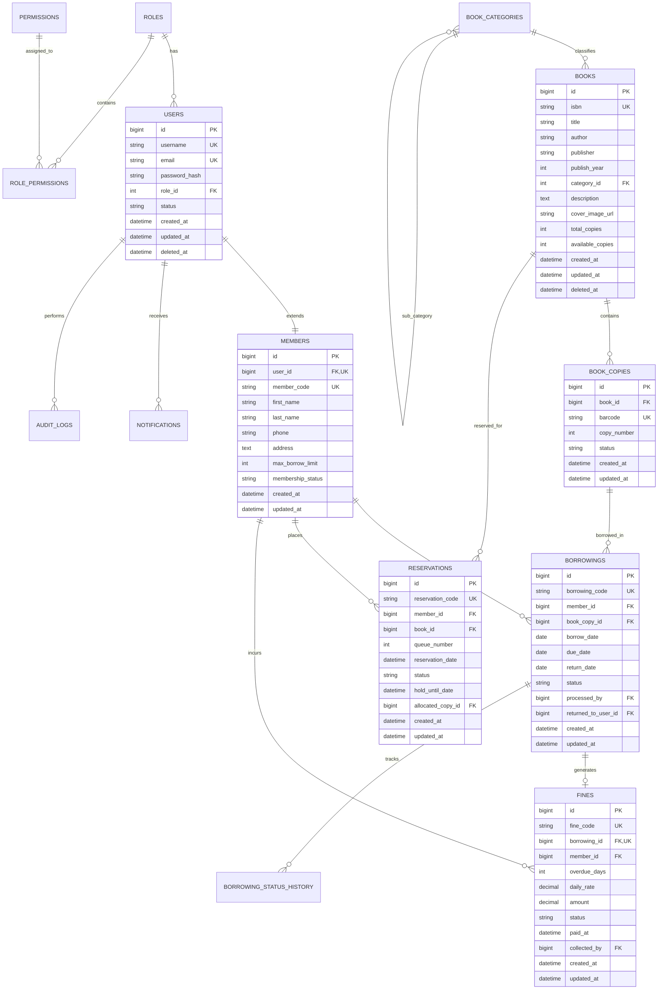

# Database Schema & Architecture Design: Online Library Management System

**Project:** Online Library Management System (ระบบจัดการห้องสมุดออนไลน์)  
**Document ID:** `05-database-design.md`  
**Phase:** Phase 1 — Planning Only (Step 5: Database Design)  
**Status:** Under Review  
**Date:** 2026-08-28  

---

## 1. Purpose
เอกสารฉบับนี้จัดทำขึ้นเพื่อกำหนดโครงสร้างสถาปัตยกรรมฐานข้อมูลเชิงสัมพันธ์ (Relational Database Architecture), แบบจำลองข้อมูลเชิงตรรกะและเชิงกายภาพ (Logical & Physical Data Model), ความสัมพันธ์ระหว่างตาราง (Entity Relationships), ดัชนีเพื่อประสิทธิภาพการสืบค้น (Index Strategy), กฎความสมบูรณ์ของข้อมูล (Integrity Constraints), และการคุ้มครองข้อมูลส่วนบุคคล (Data Privacy) สำหรับ **Online Library Management System** บนระบบจัดการฐานข้อมูล **MySQL 8** เพื่อใช้เป็นพิมพ์เขียวสำหรับการจัดทำ API Contract และ Database Migration Scripts ในลำดับถัดไป

---

## 2. Reference Documents
เอกสารที่ใช้อ้างอิงร่วมในการออกแบบฐานข้อมูล:
1. `docs/planning/01-system-overview.md` — วัตถุประสงค์ ขอบเขต และภาพรวมระบบ
2. `docs/planning/02-requirements.md` — ข้อกำหนดความต้องการ (FR-001 ถึง FR-034, BR-001 ถึง BR-008)
3. `docs/planning/03-roles-permissions.md` — บทบาท สิทธิ์ และการควบคุมการเข้าถึง (RBAC)
4. `docs/planning/04-library-workflow.md` — กระบวนการทำงาน วงจรสถานะ และ Data Consistency
5. `docs/planning/00-tech-stack-decision.md` — การตัดสินใจเลือก MySQL 8, utf8mb4, และ Docker

---

## 3. Database Design Principles
1. **Relational Normalization:** ออกแบบตามมาตรฐาน 3rd Normal Form (3NF) เพื่อลดความซ้ำซ้อนของข้อมูล (Data Redundancy) และป้องกันความผิดปกติในการปรับปรุงข้อมูล (Update Anomalies)
2. **Referential Integrity:** บังคับใช้ Foreign Key Constraints อย่างเข้มงวด เพื่อรักษาความสอดคล้องของความสัมพันธ์ระหว่างตาราง
3. **Explicit Keys:** ใช้ Primary Key ชัดเจนในทุกตาราง และกำหนด Index ที่เหมาะสมสำหรับฟิลด์ที่ใช้ค้นหาและเชื่อมโยงบ่อย
4. **Naming Conventions:** ใช้ภาษาอังกฤษตัวพิมพ์เล็กแบบ `snake_case` สำหรับชื่อตารางและคอลัมน์ และหลีกเลี่ยง SQL Reserved Words
5. **Full Unicode Support:** กำหนด Character Set เป็น `utf8mb4` และ Collation เป็น `utf8mb4_unicode_ci` เพื่อรองรับภาษาไทยและอักขระพิเศษอย่างสมบูรณ์
6. **Timezone Standardization:** เก็บข้อมูลวันเวลาในรูปแบบ `UTC` หรือ Standard Timestamp พร้อมรองรับ `created_at` และ `updated_at` ทุกตาราง
7. **Soft Delete vs Permanent History:** ใช้ Soft Delete (`deleted_at`) เฉพาะ Master Data และ Core Entities ที่จำเป็น ส่วนข้อมูลธุรกรรม (Transaction & History) จะเก็บรักษาไว้อย่างถาวร

---

## 4. Database Architecture Overview
- **Database Engine:** MySQL 8.0 (Storage Engine: `InnoDB` รองรับ ACID Transactions และ Row-level Locking)
- **Character Set & Collation:** `utf8mb4` / `utf8mb4_unicode_ci`
- **Isolation Level:** `READ COMMITTED` หรือ `REPEATABLE READ` เพื่อป้องกัน Dirty Reads และจัดการ Concurrency ในการยืม-จองหนังสือ
- **Development Tool:** phpMyAdmin บนพอร์ต `8081` เชื่อมต่อภายใน Container `db:3306`

---

## 5. Table Classification
ระบบจัดแบ่งตารางออกเป็น 4 กลุ่มหลัก:

```text
[ Database Schema: 15 Tables ]
  │
  ├── 1. Master Data Tables (5)
  │    ├── roles
  │    ├── permissions
  │    ├── role_permissions
  │    ├── book_categories
  │    └── library_settings
  │
  ├── 2. Core Entity Tables (4)
  │    ├── users
  │    ├── members
  │    ├── books
  │    └── book_copies
  │
  ├── 3. Transaction Tables (3)
  │    ├── borrowings
  │    ├── reservations
  │    └── fines
  │
  └── 4. Log & History Tables (3)
       ├── notifications
       ├── borrowing_status_history
       └── audit_logs
```

---

## 6. Table Inventory

| # | Table Name | Category | Purpose | Primary Key | Key Relationships (FKs) |
| :-: | :--- | :--- | :--- | :--- | :--- |
| 1 | `roles` | Master | เก็บข้อมูลบทบาทผู้ใช้ (Member, Librarian, Admin) | `id` (INT) | - |
| 2 | `permissions` | Master | เก็บสิทธิ์การใช้งานระบบระดับอะตอม | `id` (INT) | - |
| 3 | `role_permissions` | Master | ตารางเชื่อมความสัมพันธ์ Many-to-Many ระหว่าง Role และ Permission | `id` (INT) | `role_id`, `permission_id` |
| 4 | `book_categories` | Master | เก็บหมวดหมู่หนังสือ (เช่น วิทยาศาสตร์, วรรณกรรม) | `id` (INT) | `parent_id` (Self-reference) |
| 5 | `library_settings` | Master | เก็บค่ากำหนดของระบบ (ระยะเวลายืม, อัตราค่าปรับ) | `id` (INT) | `updated_by` -> `users(id)` |
| 6 | `users` | Core | เก็บบัญชีผู้ใช้สำหรับการ Authentication และ RBAC | `id` (BIGINT) | `role_id` -> `roles(id)` |
| 7 | `members` | Core | เก็บข้อมูลโปรไฟล์ ประวัติ และสถานะของสมาชิกห้องสมุด | `id` (BIGINT) | `user_id` -> `users(id)` |
| 8 | `books` | Core | เก็บข้อมูลบรรณานุกรมของหนังสือ (Title, Author, ISBN) | `id` (BIGINT) | `category_id` -> `book_categories(id)` |
| 9 | `book_copies` | Core | เก็บสำเนาหนังสือแต่ละเล่มจริงและสถานะพร้อมยืม | `id` (BIGINT) | `book_id` -> `books(id)` |
| 10 | `borrowings` | Transaction | เก็บบันทึกรายการยืม วันครบกำหนด และการคืนหนังสือ | `id` (BIGINT) | `member_id`, `book_copy_id`, `processed_by` |
| 11 | `reservations` | Transaction | เก็บคิวการจองหนังสือเมื่อไม่มีสำเนาว่าง | `id` (BIGINT) | `member_id`, `book_id`, `allocated_copy_id` |
| 12 | `fines` | Transaction | เก็บรายการค่าปรับจากการส่งคืนหนังสือล่าช้า | `id` (BIGINT) | `borrowing_id`, `member_id`, `collected_by` |
| 13 | `notifications` | Log/History | เก็บข้อความแจ้งเตือนภายในระบบไปยังผู้ใช้ | `id` (BIGINT) | `user_id` -> `users(id)` |
| 14 | `borrowing_status_history`| Log/History | เก็บประวัติการเปลี่ยนสถานะการยืมเพื่อการตรวจสอบ | `id` (BIGINT) | `borrowing_id`, `changed_by` |
| 15 | `audit_logs` | Log/History | เก็บบันทึกประวัติกิจกรรมความปลอดภัยและการเปลี่ยนแปลงสำคัญ | `id` (BIGINT) | `user_id` -> `users(id)` |

---

## 7. User & Authentication Data Model
โครงสร้างตารางจัดการความปลอดภัยและการยืนยันตัวตน:
- `roles`: กำหนดบทบาทมาตรฐาน (`member`, `librarian`, `admin`)
- `permissions`: ระบุชื่อสิทธิ์ (เช่น `books.create`, `borrowings.process`, `fines.waive`)
- `role_permissions`: ผูกสิทธิ์เข้ากับแต่ละบทบาท
- `users`: จัดเก็บ `username`, `email`, `password_hash` (เข้ารหัสด้วย bcrypt), `role_id`, และ `status` (`active`, `suspended`, `inactive`)

---

## 8. Member Data Model
- `members`: แยกออกจาก `users` เพื่อแบ่งแยก Authentication Credentials ออกจาก Business Profile
- จัดเก็บข้อมูล: `member_code` (รหัสสมาชิก), `first_name`, `last_name`, `phone`, `address`, `max_borrow_limit`, และ `membership_status`
- เชื่อมโยงแบบ One-to-One (`user_id` UNIQUE) กับตาราง `users`

---

## 9. Book Data Model
- `books`: เก็บข้อมูลบรรณานุกรมเชิงวิชาการ (Bibliographic Level)
- จัดเก็บข้อมูล: `isbn` (รองรับ ISBN-10/13), `title`, `author`, `publisher`, `publish_year`, `category_id`, `description`, `cover_image_url`, `total_copies`, `available_copies`
- **หมายเหตุ:** ในเฟสนี้ ข้อมูลผู้แต่ง (Author) และสำนักพิมพ์ (Publisher) จัดเก็บเป็น Text Field ในตาราง `books` โดยตรงเพื่อความเรียบง่ายตาม Scope (หากต้องการระบบ Author Master Data ในอนาคตสามารถแยก Table ได้)

---

## 10. Author / Category / Publisher Architecture
- `book_categories`: ตาราง Master Category รองรับโครงสร้างหมวดหมู่แบบ Hierarchy ผ่าน `parent_id`
- รองรับการจัดหมวดหมู่หนังสือ และการนับจำนวนหนังสือในแต่ละหมวดหมู่อย่างมีประสิทธิภาพ

---

## 11. Book Copy & Availability Data Model
- `book_copies`: เป็นตัวแทนของ **เล่มจริงทางกายภาพ (Physical Copy)** ของหนังสือแต่ละเล่ม
- จัดเก็บข้อมูล: `book_id`, `barcode` (หรือ Accession Number ประจำเล่ม), `copy_number`, `status` (`available`, `borrowed`, `reserved_hold`, `maintenance`, `lost`)
- **ความสัมพันธ์กับสต็อก:** 
  - `books.total_copies` = ผลรวมของ `book_copies` ทั้งหมดของหนังสือนั้น
  - `books.available_copies` = จำนวน `book_copies` ที่มีสถานะเป็น `available`

---

## 12. Borrowing Data Model
- `borrowings`: บันทึกธุรกรรมการยืมหนังสือของสมาชิกแต่ละครั้ง
- จัดเก็บข้อมูล: `borrowing_code`, `member_id`, `book_copy_id`, `borrow_date`, `due_date`, `return_date`, `status` (`borrowed`, `overdue`, `returned`), `processed_by` (Librarian ID ผู้ทำรายการ), `notes`

---

## 13. Return Data Model Analysis
- **การตัดสินใจเชิงสถาปัตยกรรม:** จัดเก็บข้อมูลการรับคืนหนังสือไว้ในตาราง `borrowings` โดยตรงผ่านฟิลด์ `return_date`, `status = 'returned'`, และ `returned_to_user_id` โดย**ไม่สร้างตาราง `returns` แยก**
- **เหตุผล:**
  1. การยืมและการคืนเป็นธุรกรรมในวงจรเดียวกัน (1:1 Lifecycle)
  2. ลดการ Join ตารางที่ซ้ำซ้อน และรักษาความต่อเนื่องของข้อมูล
  3. บันทึกประวัติการเปลี่ยนสถานะผ่านตาราง `borrowing_status_history` เพื่อ Audit ได้อย่างสมบูรณ์

---

## 14. Reservation Data Model
- `reservations`: จัดการคิวการจองหนังสือที่ไม่มีสำเนาว่าง
- จัดเก็บข้อมูล: `reservation_code`, `member_id`, `book_id`, `queue_number`, `reservation_date`, `status` (`pending`, `available`, `fulfilled`, `cancelled`, `expired`), `hold_until_date` (วันหมดสิทธิ์รับหนังสือ), `allocated_copy_id` (สำเนาที่ถูกล็อคให้เมื่อหนังสือถูกคืน)
- **Constraint:** สมาชิก 1 คน จองหนังสือเล่มเดียวกันซ้ำไม่ได้ขณะที่สถานะยังเป็น `pending` หรือ `available`

---

## 15. Fine Data Model
- `fines`: บันทึกข้อมูลค่าปรับที่เกิดจากการส่งคืนล่าช้า
- จัดเก็บข้อมูล: `fine_code`, `borrowing_id`, `member_id`, `overdue_days` (จำนวนวันที่เกิน), `daily_rate` (อัตราค่าปรับต่อวันขณะเกิดรายการ), `amount` (ยอดเงินรวม), `status` (`unpaid`, `paid`, `waived`), `paid_at`, `collected_by` (Librarian/Admin ID), `waived_reason`
- **ความสัมพันธ์:** ผูกโยงกับ `borrowings` (1:1 หรือ 1:N) และ `members` อย่างชัดเจน

---

## 16. Notification Data Model
- `notifications`: จัดเก็บข้อความแจ้งเตือนภายในเว็บแอปพลิเคชัน (In-App Notifications)
- จัดเก็บข้อมูล: `user_id`, `type` (`borrow_success`, `due_reminder`, `overdue_alert`, `reservation_available`, `fine_issued`, `fine_paid`), `title`, `message`, `is_read` (Boolean), `read_at`, `related_entity_type`, `related_entity_id`

---

## 17. Status History Data Model
- `borrowing_status_history`: ติดตามทุกการเปลี่ยนสถานะในธุรกรรมการยืม (`borrowed` -> `overdue` -> `returned`)
- จัดเก็บข้อมูล: `borrowing_id`, `from_status`, `to_status`, `changed_by` (User ID หรือ System Scheduler), `change_reason`, `created_at`

---

## 18. Audit Log Data Model
- `audit_logs`: บันทึกกิจกรรมความปลอดภัยและการปรับปรุงข้อมูลสำคัญระดับระบบ
- จัดเก็บข้อมูล: `user_id`, `action` (เช่น `USER_ROLE_UPDATED`, `FINE_WAIVED`, `BOOK_DELETED`), `entity_name`, `entity_id`, `old_values` (JSON), `new_values` (JSON), `ip_address`, `user_agent`, `created_at`

---

## 19. Relationships & Cardinality Overview

```text
[roles] 1 ──────── N [users]
[roles] 1 ──────── N [role_permissions] N ──────── 1 [permissions]
[users] 1 ──────── 1 [members]
[users] 1 ──────── N [notifications]
[users] 1 ──────── N [audit_logs]

[book_categories] 1 ──────── N [books]
[books] 1 ──────── N [book_copies]
[books] 1 ──────── N [reservations]

[members] 1 ──────── N [borrowings]
[members] 1 ──────── N [reservations]
[members] 1 ──────── N [fines]

[book_copies] 1 ──────── N [borrowings]
[borrowings] 1 ──────── 1 [fines]
[borrowings] 1 ──────── N [borrowing_status_history]
```

---

## 20. Primary Key Strategy
- **Master Tables:** ใช้ `INT UNSIGNED AUTO_INCREMENT` (เนื่องจากจำนวนแถวมีจำกัด เช่น บทบาท, หมวดหมู่)
- **Core & Transaction Tables:** ใช้ `BIGINT UNSIGNED AUTO_INCREMENT` สำหรับ Primary Key เพื่อรองรับการขยายตัวของข้อมูลธุรกรรมนับล้านรายการได้อย่างปลอดภัยและมีประสิทธิภาพสูงสุดในการทำ Indexing

---

## 21. Foreign Key Constraints & Behaviors

| Foreign Key Constraint | Source Table -> Target Table | Delete Behavior | Update Behavior | เหตุผลทางธุรกิจ |
| :--- | :--- | :--- | :--- | :--- |
| `fk_users_role` | `users(role_id)` -> `roles(id)` | **RESTRICT** | **CASCADE** | ห้ามลบ Role หากยังมี User ผูกอยู่ |
| `fk_members_user` | `members(user_id)` -> `users(id)` | **RESTRICT** | **CASCADE** | รักษาความสมบูรณ์ของบัญชีสมาชิก |
| `fk_books_category` | `books(category_id)` -> `book_categories(id)` | **RESTRICT** | **CASCADE** | ห้ามลบหมวดหมู่หากมีหนังสือผูกอยู่ |
| `fk_copies_book` | `book_copies(book_id)` -> `books(id)` | **CASCADE** | **CASCADE** | หากลบข้อมูลหนังสือ สำเนาจะถูกจัดการพร้อมกัน |
| `fk_borrows_member` | `borrowings(member_id)` -> `members(id)` | **RESTRICT** | **CASCADE** | ห้ามลบสมาชิกที่มีประวัติการยืม |
| `fk_borrows_copy` | `borrowings(book_copy_id)` -> `book_copies(id)` | **RESTRICT** | **CASCADE** | ห้ามลบสำเนาหนังสือที่มีประวัติการยืม |
| `fk_reservations_member` | `reservations(member_id)` -> `members(id)` | **RESTRICT** | **CASCADE** | ห้ามลบสมาชิกที่มีประวัติการจอง |
| `fk_reservations_book` | `reservations(book_id)` -> `books(id)` | **RESTRICT** | **CASCADE** | ห้ามลบหนังสือที่มีคิวจองค้างอยู่ |
| `fk_fines_borrowing` | `fines(borrowing_id)` -> `borrowings(id)` | **RESTRICT** | **CASCADE** | ค่าปรับต้องผูกกับรายการยืมอย่างสมบูรณ์ |

---

## 22. Index Strategy
ดัชนีถูกออกแบบเพื่อเพิ่มประสิทธิภาพการค้นหาและลดภาระการประมวลผลของ Database:

1. **Unique Indexes:**
   - `users(username)`, `users(email)`
   - `members(member_code)`, `members(user_id)`
   - `books(isbn)`
   - `book_copies(barcode)`
   - `borrowings(borrowing_code)`, `reservations(reservation_code)`, `fines(fine_code)`
2. **Search & Filter Indexes:**
   - `books(title)`, `books(author)`, `books(category_id)`
   - `book_copies(book_id, status)` (Composite Index สำหรับตรวจสอบสต็อกว่าง)
3. **Transaction & Operational Indexes:**
   - `borrowings(member_id, status)` (ตรวจสอบรายการยืมปัจจุบันของสมาชิก)
   - `borrowings(due_date, status)` (ตรวจจับรายการ Overdue)
   - `reservations(book_id, status, queue_number)` (ดึงคิวจองลำดับถัดไป)
   - `fines(member_id, status)` (ตรวจสอบหนี้ค้างชำระของสมาชิก)
   - `notifications(user_id, is_read)` (ดึงการแจ้งเตือนที่ยังไม่ได้อ่าน)

---

## 23. Data Integrity & Business Constraints
- `NOT NULL` บังคับใช้กับทุก Field ที่จำเป็นต่อการคำนวณและระบุตัวตน
- `CHECK (available_copies >= 0)` ป้องกันสต็อกหนังสือติดลบ
- `CHECK (amount >= 0)` ป้องกันยอดเงินค่าปรับติดลบ
- `CHECK (due_date >= borrow_date)` ป้องกันความผิดพลาดของวันกำหนดส่ง
- `UNIQUE (member_id, book_id, active_reservation_flag)` ป้องกันการจองหนังสือเล่มเดียวกันซ้ำ

---

## 24. Soft Delete Strategy
- ตารางที่รองรับ Soft Delete ผ่านฟิลด์ `deleted_at (DateTime, Nullable)`:
  - `books`, `book_categories`, `users`, `members`
- ตารางที่ไม่ใช้ Soft Delete เพื่อรักษา Audit History อย่างถาวร:
  - `borrowings`, `reservations`, `fines`, `borrowing_status_history`, `audit_logs`

---

## 25. Personal Data & Privacy Considerations (PDPA / Data Protection)
- **ข้อมูลส่วนบุคคล (PII):** `first_name`, `last_name`, `email`, `phone`, `address`
- **มาตรการคุ้มครองข้อมูล:**
  1. รหัสผ่านถูกจัดเก็บเป็น Hash ด้วย `bcrypt` เท่านั้น
  2. ข้อมูลสมาชิกจำกัดการเข้าถึงเฉพาะเจ้าของข้อมูล (Member) และบุคลากรที่ได้รับมอบหมาย (Librarian/Admin)
  3. ไม่เปิดเผยข้อมูลสมาชิกใน API สาธารณะสำหรับค้นหาหนังสือ
  4. ทุกการเข้าถึงและแก้ไขข้อมูลส่วนบุคคลระดับระบบจะถูกบันทึกลงใน `audit_logs`

---

## 26. Data Retention & Archival Guidelines
- ข้อมูลรายการยืม-คืน (`borrowings`) และประวัติค่าปรับ (`fines`): เก็บรักษาไว้อย่างน้อย 5-10 ปี ตามมาตรฐานประวัติงานห้องสมุด
- ข้อมูล Audit Logs (`audit_logs`): เก็บรักษาไว้อย่างน้อย 1-3 ปี เพื่อความปลอดภัยและการตรวจสอบย้อนหลัง
- ข้อมูลการแจ้งเตือน (`notifications`): สามารถพิจารณา Clear หรือ Archive ข้อความที่อ่านแล้วและเก่าเกิน 6 เดือน

---

## 27. Dashboard & Reporting Support
การออกแบบ Schema รองรับการ Query ข้อมูลเพื่อแสดงผล Dashboard และรายงานสถิติโดยไม่ต้องสร้างตารางแยกซ้ำซ้อน:
- **ยอดหนังสือทั้งหมดและพร้อมยืม:** `SELECT SUM(total_copies), SUM(available_copies) FROM books`
- **ยอดการยืมปัจจุบัน:** `SELECT COUNT(*) FROM borrowings WHERE status = 'borrowed'`
- **ยอดรายการค้างส่ง:** `SELECT COUNT(*) FROM borrowings WHERE status = 'overdue'`
- **ยอดค่าปรับค้างชำระ:** `SELECT SUM(amount) FROM fines WHERE status = 'unpaid'`
- **หนังสือยอดนิยม:** `SELECT book_id, COUNT(*) FROM borrowings ... GROUP BY book_id ORDER BY COUNT(*) DESC`

---

## 28. Scalability Considerations
- รองรับการแบ่ง Partition ตาราง `audit_logs` และ `borrowing_status_history` ตามช่วงเวลา (Range by Year) หากปริมาณข้อมูลเพิ่มสูงขึ้นในอนาคต
- การใช้ `BIGINT` เป็น Primary Key ป้องกันปัญหา ID เต็ม (ID Exhaustion) ตลอดอายุการใช้งานของระบบ

---

## 29. Database ERD Description (Mermaid Diagram)



---

## 30. Table Specifications (Conceptual Data Dictionaries)

### 30.1 Table: `roles`
| Field | Type (Conceptual) | Nullable | Key | Description |
| :--- | :--- | :---: | :---: | :--- |
| `id` | Integer | NO | PK | รหัสบทบาท (Auto-increment) |
| `name` | String(50) | NO | UK | ชื่อบทบาท (`member`, `librarian`, `admin`) |
| `description` | String(255) | YES | - | คำอธิบายหน้าที่ของบทบาท |
| `created_at` | DateTime | NO | - | วันเวลาที่สร้าง |

### 30.2 Table: `permissions`
| Field | Type (Conceptual) | Nullable | Key | Description |
| :--- | :--- | :---: | :---: | :--- |
| `id` | Integer | NO | PK | รหัสสิทธิ์ (Auto-increment) |
| `code` | String(100) | NO | UK | รหัสสิทธิ์ (เช่น `books.create`, `borrow.process`) |
| `name` | String(100) | NO | - | ชื่อสิทธิ์ |
| `module` | String(50) | NO | - | โมดูลที่เกี่ยวข้อง |
| `created_at` | DateTime | NO | - | วันเวลาที่สร้าง |

### 30.3 Table: `role_permissions`
| Field | Type (Conceptual) | Nullable | Key | Description |
| :--- | :--- | :---: | :---: | :--- |
| `id` | Integer | NO | PK | รหัสรายการเชื่อมโยง |
| `role_id` | Integer | NO | FK | รหัสบทบาท -> `roles(id)` |
| `permission_id`| Integer | NO | FK | รหัสสิทธิ์ -> `permissions(id)` |

### 30.4 Table: `book_categories`
| Field | Type (Conceptual) | Nullable | Key | Description |
| :--- | :--- | :---: | :---: | :--- |
| `id` | Integer | NO | PK | รหัสหมวดหมู่ (Auto-increment) |
| `name` | String(100) | NO | UK | ชื่อหมวดหมู่หนังสือ |
| `description` | String(255) | YES | - | คำอธิบายหมวดหมู่ |
| `parent_id` | Integer | YES | FK | หมวดหมู่หลัก (Self-reference) |
| `created_at` | DateTime | NO | - | วันเวลาที่สร้าง |
| `deleted_at` | DateTime | YES | - | วันเวลาที่ Soft Delete |

### 30.5 Table: `library_settings`
| Field | Type (Conceptual) | Nullable | Key | Description |
| :--- | :--- | :---: | :---: | :--- |
| `id` | Integer | NO | PK | รหัสการตั้งค่า |
| `setting_key` | String(100) | NO | UK | ชื่อคีย์การตั้งค่า (เช่น `default_borrow_days`, `fine_rate_per_day`) |
| `setting_value`| String(255) | NO | - | ค่าของคีย์ |
| `description` | String(255) | YES | - | คำอธิบายการตั้งค่า |
| `updated_by` | BigInteger | YES | FK | ผู้แก้ไขล่าสุด -> `users(id)` |
| `updated_at` | DateTime | NO | - | วันเวลาที่แก้ไข |

### 30.6 Table: `users`
| Field | Type (Conceptual) | Nullable | Key | Description |
| :--- | :--- | :---: | :---: | :--- |
| `id` | BigInteger | NO | PK | รหัสผู้ใช้งานระบบ |
| `username` | String(50) | NO | UK | ชื่อบัญชีผู้ใช้งาน |
| `email` | String(100) | NO | UK | อีเมลผู้ใช้งาน |
| `password_hash`| String(255) | NO | - | รหัสผ่านที่ผ่านการ Hash ด้วย bcrypt |
| `role_id` | Integer | NO | FK | รหัสบทบาท -> `roles(id)` |
| `status` | String(20) | NO | - | สถานะบัญชี (`active`, `suspended`, `inactive`) |
| `created_at` | DateTime | NO | - | วันเวลาที่ลงทะเบียน |
| `updated_at` | DateTime | NO | - | วันเวลาที่ปรับปรุงล่าสุด |
| `deleted_at` | DateTime | YES | - | วันเวลาที่ระงับ/ลบบัญชี |

### 30.7 Table: `members`
| Field | Type (Conceptual) | Nullable | Key | Description |
| :--- | :--- | :---: | :---: | :--- |
| `id` | BigInteger | NO | PK | รหัสข้อมูลสมาชิก |
| `user_id` | BigInteger | NO | FK, UK | รหัสบัญชีผู้ใช้ -> `users(id)` |
| `member_code` | String(30) | NO | UK | รหัสประจำตัวสมาชิกห้องสมุด |
| `first_name` | String(100) | NO | - | ชื่อจริง |
| `last_name` | String(100) | NO | - | นามสกุล |
| `phone` | String(20) | YES | - | เบอร์โทรศัพท์ติดต่อ |
| `address` | Text | YES | - | ที่อยู่สำหรับติดต่อ |
| `max_borrow_limit`| Integer | NO | - | จำนวนหนังสือสูงสุดที่ยืมได้พร้อมกัน (Default: 3-5) |
| `membership_status`| String(20) | NO | - | สถานะสมาชิก (`active`, `expired`, `suspended`) |
| `created_at` | DateTime | NO | - | วันเวลาที่สร้างข้อมูล |
| `updated_at` | DateTime | NO | - | วันเวลาที่ปรับปรุงข้อมูล |

### 30.8 Table: `books`
| Field | Type (Conceptual) | Nullable | Key | Description |
| :--- | :--- | :---: | :---: | :--- |
| `id` | BigInteger | NO | PK | รหัสหนังสือบรรณานุกรม |
| `isbn` | String(20) | NO | UK | เลขมาตรฐานสากลประจำหนังสือ (ISBN) |
| `title` | String(255) | NO | Index | ชื่อเรื่องหนังสือ |
| `author` | String(255) | NO | Index | ชื่อผู้แต่ง/ผู้ประพันธ์ |
| `publisher` | String(255) | YES | - | สำนักพิมพ์ |
| `publish_year` | Integer | YES | - | ปีที่พิมพ์ |
| `category_id` | Integer | NO | FK | หมวดหมู่หนังสือ -> `book_categories(id)` |
| `description` | Text | YES | - | เรื่องย่อ / รายละเอียดหนังสือ |
| `cover_image_url`| String(255) | YES | - | URL รูปภาพหน้าปก |
| `total_copies` | Integer | NO | - | จำนวนสำเนาทั้งหมด (>= 0) |
| `available_copies`| Integer | NO | - | จำนวนสำเนาพร้อมยืม (>= 0) |
| `created_at` | DateTime | NO | - | วันเวลาที่บันทึก |
| `updated_at` | DateTime | NO | - | วันเวลาที่แก้ไข |
| `deleted_at` | DateTime | YES | - | วันเวลาที่ Soft Delete |

### 30.9 Table: `book_copies`
| Field | Type (Conceptual) | Nullable | Key | Description |
| :--- | :--- | :---: | :---: | :--- |
| `id` | BigInteger | NO | PK | รหัสสำเนาหนังสือประจำเล่มจริง |
| `book_id` | BigInteger | NO | FK | รหัสหนังสือหลัก -> `books(id)` |
| `barcode` | String(50) | NO | UK | รหัสบาร์โค้ดประจำเล่มจริง |
| `copy_number` | Integer | NO | - | ลำดับเล่มที่ของหนังสือเล่มนี้ |
| `status` | String(20) | NO | Index | สถานะสำเนา (`available`, `borrowed`, `reserved_hold`, `maintenance`, `lost`) |
| `created_at` | DateTime | NO | - | วันเวลาที่บันทึก |
| `updated_at` | DateTime | NO | - | วันเวลาที่แก้ไขสถานะ |

### 30.10 Table: `borrowings`
| Field | Type (Conceptual) | Nullable | Key | Description |
| :--- | :--- | :---: | :---: | :--- |
| `id` | BigInteger | NO | PK | รหัสรายการยืม |
| `borrowing_code`| String(30) | NO | UK | รหัสอ้างอิงธุรกรรมการยืม (เช่น `BRW-202608-0001`) |
| `member_id` | BigInteger | NO | FK | รหัสสมาชิกผู้ยืม -> `members(id)` |
| `book_copy_id` | BigInteger | NO | FK | รหัสสำเนาหนังสือที่ยืม -> `book_copies(id)` |
| `borrow_date` | Date | NO | - | วันที่ทำรายการยืม |
| `due_date` | Date | NO | Index | วันครบกำหนดส่งคืน |
| `return_date` | Date | YES | - | วันที่ส่งคืนจริง (Null เมื่อยังไม่คืน) |
| `status` | String(20) | NO | Index | สถานะรายการ (`borrowed`, `overdue`, `returned`) |
| `processed_by` | BigInteger | NO | FK | เจ้าหน้าที่ผู้ทำรายการ -> `users(id)` |
| `returned_to_user_id`| BigInteger | YES | FK | เจ้าหน้าที่ผู้รับคืน -> `users(id)` |
| `notes` | Text | YES | - | บันทึกเพิ่มเติม |
| `created_at` | DateTime | NO | - | วันเวลาที่สร้างรายการ |
| `updated_at` | DateTime | NO | - | วันเวลาที่ปรับปรุงล่าสุด |

### 30.11 Table: `reservations`
| Field | Type (Conceptual) | Nullable | Key | Description |
| :--- | :--- | :---: | :---: | :--- |
| `id` | BigInteger | NO | PK | รหัสรายการจอง |
| `reservation_code`| String(30) | NO | UK | รหัสอ้างอิงการจอง (เช่น `RSV-202608-0001`) |
| `member_id` | BigInteger | NO | FK | สมาชิกผู้จอง -> `members(id)` |
| `book_id` | BigInteger | NO | FK | หนังสือที่จอง -> `books(id)` |
| `queue_number` | Integer | NO | Index | ลำดับคิวการจอง |
| `reservation_date`| DateTime | NO | - | วันเวลาที่ทำรายการจอง |
| `status` | String(20) | NO | Index | สถานะการจอง (`pending`, `available`, `fulfilled`, `cancelled`, `expired`) |
| `hold_until_date`| DateTime | YES | - | วันเวลาสิ้นสุดการถือครองสิทธิ์รับหนังสือ |
| `allocated_copy_id`| BigInteger | YES | FK | สำเนาที่ล็อคไว้ให้ -> `book_copies(id)` |
| `created_at` | DateTime | NO | - | วันเวลาที่สร้างรายการ |
| `updated_at` | DateTime | NO | - | วันเวลาที่ปรับปรุง |

### 30.12 Table: `fines`
| Field | Type (Conceptual) | Nullable | Key | Description |
| :--- | :--- | :---: | :---: | :--- |
| `id` | BigInteger | NO | PK | รหัสรายการค่าปรับ |
| `fine_code` | String(30) | NO | UK | รหัสอ้างอิงค่าปรับ (เช่น `FIN-202608-0001`) |
| `borrowing_id` | BigInteger | NO | FK, UK | รายการยืมต้นเหตุ -> `borrowings(id)` |
| `member_id` | BigInteger | NO | FK | สมาชิกผู้มีภาระค่าปรับ -> `members(id)` |
| `overdue_days` | Integer | NO | - | จำนวนวันที่ส่งคืนเกินกำหนด |
| `daily_rate` | Decimal(10,2)| NO | - | อัตราค่าปรับต่อวัน ณ ขณะเกิดรายการ |
| `amount` | Decimal(10,2)| NO | - | จำนวนเงินค่าปรับรวม |
| `status` | String(20) | NO | Index | สถานะค่าปรับ (`unpaid`, `paid`, `waived`) |
| `paid_at` | DateTime | YES | - | วันเวลาที่ชำระเงิน |
| `collected_by` | BigInteger | YES | FK | เจ้าหน้าที่ผู้บันทึกการชำระ -> `users(id)` |
| `waived_reason`| String(255) | YES | - | เหตุผลในการยกเว้นค่าปรับ (ถ้ามี) |
| `created_at` | DateTime | NO | - | วันเวลาที่สร้างรายการ |
| `updated_at` | DateTime | NO | - | วันเวลาที่ปรับปรุง |

### 30.13 Table: `notifications`
| Field | Type (Conceptual) | Nullable | Key | Description |
| :--- | :--- | :---: | :---: | :--- |
| `id` | BigInteger | NO | PK | รหัสการแจ้งเตือน |
| `user_id` | BigInteger | NO | FK | ผู้รับการแจ้งเตือน -> `users(id)` |
| `type` | String(50) | NO | - | ประเภทการแจ้งเตือน (เช่น `due_reminder`, `overdue_alert`) |
| `title` | String(255) | NO | - | หัวข้อข้อความแจ้งเตือน |
| `message` | Text | NO | - | เนื้อหาข้อความแจ้งเตือน |
| `is_read` | Boolean | NO | Index | สถานะการอ่าน (`0 = Unread`, `1 = Read`) |
| `read_at` | DateTime | YES | - | วันเวลาที่เปิดอ่าน |
| `related_entity_type`| String(50)| YES | - | ชื่อ Entity ที่เกี่ยวข้อง (เช่น `borrowings`, `reservations`) |
| `related_entity_id` | BigInteger | YES | - | ID ของ Entity ที่เกี่ยวข้อง |
| `created_at` | DateTime | NO | Index | วันเวลาที่ส่งข้อความ |

### 30.14 Table: `borrowing_status_history`
| Field | Type (Conceptual) | Nullable | Key | Description |
| :--- | :--- | :---: | :---: | :--- |
| `id` | BigInteger | NO | PK | รหัสประวัติสถานะ |
| `borrowing_id` | BigInteger | NO | FK | รายการยืมที่ถูกเปลี่ยน -> `borrowings(id)` |
| `from_status` | String(20) | YES | - | สถานะเดิม |
| `to_status` | String(20) | NO | - | สถานะใหม่ที่เปลี่ยนไป |
| `changed_by` | BigInteger | YES | FK | ผู้เปลี่ยนสถานะ -> `users(id)` (Null = System) |
| `change_reason`| String(255) | YES | - | เหตุผลในการเปลี่ยนสถานะ |
| `created_at` | DateTime | NO | - | วันเวลาที่เปลี่ยนสถานะ |

### 30.15 Table: `audit_logs`
| Field | Type (Conceptual) | Nullable | Key | Description |
| :--- | :--- | :---: | :---: | :--- |
| `id` | BigInteger | NO | PK | รหัสประวัติความปลอดภัย |
| `user_id` | BigInteger | YES | FK | ผู้กระทำกิจกรรม -> `users(id)` |
| `action` | String(100) | NO | Index | ชื่อการกระทำ (เช่น `USER_ROLE_UPDATED`) |
| `entity_name` | String(50) | NO | - | ชื่อตารางที่เกิดการเปลี่ยนแปลง |
| `entity_id` | BigInteger | YES | - | Primary Key ของตารางที่เปลี่ยน |
| `old_values` | JSON | YES | - | ข้อมูลเดิมก่อนการแก้ไข |
| `new_values` | JSON | YES | - | ข้อมูลใหม่หลังการแก้ไข |
| `ip_address` | String(45) | YES | - | IP Address ของ Client |
| `user_agent` | String(255) | YES | - | ข้อมูล Browser / Device |
| `created_at` | DateTime | NO | Index | วันเวลาที่เกิดกิจกรรม |

---

## 31. Requirement Traceability Matrix

| Data Entity / Tables | Functional Requirements | Business Rules |
| :--- | :--- | :--- |
| `roles`, `permissions`, `role_permissions`, `users` | `FR-001`, `FR-002`, `FR-003`, `FR-004`, `FR-033` | - |
| `members` | `FR-005`, `FR-006`, `FR-007` | `BR-001` |
| `book_categories`, `books`, `book_copies` | `FR-008`, `FR-009`, `FR-010`, `FR-011`, `FR-012`, `FR-013` | `BR-002` |
| `borrowings`, `borrowing_status_history` | `FR-015`, `FR-016`, `FR-017`, `FR-018`, `FR-019` | `BR-001`, `BR-002`, `BR-003`, `BR-004` |
| `reservations` | `FR-020`, `FR-021`, `FR-022` | `BR-005`, `BR-006`, `BR-007` |
| `fines` | `FR-023`, `FR-024`, `FR-025` | `BR-004`, `BR-008` |
| `notifications` | `FR-026`, `FR-027`, `FR-028` | `BR-007` |
| `audit_logs` | `FR-034` | - |
| `library_settings` | `FR-033` | `BR-003`, `BR-004` |

---

## 32. Database Design Validation Checklist
- [x] **Requirement Coverage:** มีตารางรองรับทุก Functional Requirement (`FR-001` ถึง `FR-034`)
- [x] **Workflow Coverage:** รองรับข้อมูลธุรกรรมยืม คืน เกินกำหนด ค่าปรับ และคิวการจองครบถ้วน
- [x] **Role & Authorization Coverage:** ตาราง `users`, `roles`, `permissions` รองรับการทำ RBAC สมบูรณ์
- [x] **History & Audit Coverage:** มีตาราง `borrowing_status_history` และ `audit_logs` รองรับการตรวจสอบย้อนหลัง
- [x] **Referential Integrity:** มี Foreign Key และ Cascade Rules ที่ถูกต้องตาม Business Meaning
- [x] **Data Redundancy Minimized:** ผ่านเกณฑ์การทำ Normalization (3NF)
- [x] **Scalability Supported:** ใช้ `BIGINT` เป็น PK สำหรับตารางธุรกรรม และมี Index ครบทุกจุดค้นหา

---

## 33. Open Questions (ประเด็น Database ที่ต้องการการยืนยัน)

| ID | คำถาม / ข้อสงสัยเกี่ยวกับฐานข้อมูล | ตารางที่ได้รับผลกระทบ | ผลกระทบ | ลำดับความสำคัญ |
| :--- | :--- | :--- | :---: | :---: |
| **OQ-DB-001** | ในอนาคตต้องการให้หนังสือ 1 เล่ม มีผู้แต่งหลายคน (Many-to-Many via `authors` & `book_authors`) หรือคงไว้เป็น Text Field ใน `books`? | `books` | Low | Medium |
| **OQ-DB-002** | ต้องการจัดเก็บข้อมูลตำแหน่งจัดวางของหนังสือ (Location / Shelf / Call Number) ในระดับ `books` หรือ `book_copies` หรือไม่? | `book_copies` | Low | Low |
| **OQ-DB-003** | ระยะเวลาในการเคลียร์ข้อความแจ้งเตือนที่อ่านแล้ว (Notification Purge Policy) ควรกำหนดไว้ที่กี่วัน (เช่น 90 วัน หรือ 180 วัน)? | `notifications` | Low | Low |

---

## 34. Assumptions
1. ฐานข้อมูลใช้ MySQL 8.0 Engine InnoDB และกำหนด Charset เป็น `utf8mb4` เสมอ
2. การคำนวณและตัดสต็อกหนังสือ (`total_copies`, `available_copies`) จะทำผ่าน Backend Transaction ร่วมกับ Row-level Lock
3. ไม่มีการจัดเก็บข้อมูลบัตรเครดิตหรือข้อมูลการชำระเงินจริงในฐานข้อมูลในเฟสนี้

---

## 35. Risks & Mitigation Strategies
- **ความเสี่ยง Concurrency ในการตัดสต็อกหนังสือ:** ป้องกันโดยใช้ `SELECT ... FOR UPDATE` หรือ Database Transaction ในระดับ Backend
- **ความเสี่ยงตาราง Audit Log โตเร็วเกินไป:** กำหนด Index เฉพาะ `action` และ `created_at` พร้อมเตรียมแนวทาง Archive ในอนาคต
- **ความเสี่ยงการจองซ้ำซ้อน:** ใช้ Unique Composite Index ป้องกันไม่ให้สมาชิกสร้างรายการจองหนังสือเล่มเดิมซ้ำ

---

## 36. Summary
เอกสาร **Database Schema & Architecture Design** ฉบับนี้ได้กำหนดโครงสร้างตารางฐานข้อมูลทั้งหมด 15 ตาราง แบ่งเป็น Master Data (5), Core Entities (4), Transaction Tables (3), และ Log/History (3) พร้อมทั้งกำหนด Data Dictionaries, ความสัมพันธ์ (ERD), กลยุทธ์การทำ Index, และมาตรการความปลอดภัยของข้อมูลไว้อย่างครบถ้วนตามหลักการ Relational Database Design เอกสารนี้พร้อมนำไปใช้เป็นรากฐานสำหรับ **Planning Step 6: API Contract (`06-api-contract.md`)** ต่อไป
