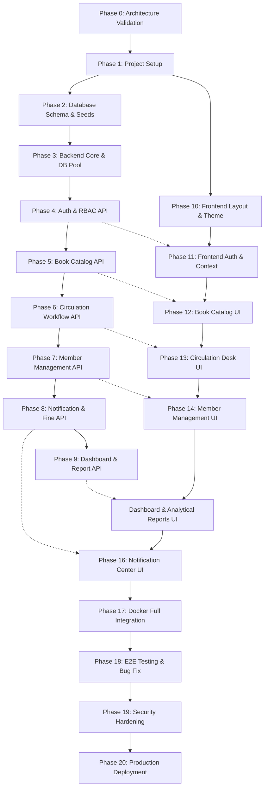

# Master Implementation Plan: Online Library Management System

**Project:** Online Library Management System (ระบบจัดการห้องสมุดออนไลน์)  
**Document ID:** `10-implementation-plan.md`  
**Phase:** Phase 1 — Planning Only (Step 10: Implementation Plan)  
**Status:** Approved & Ready for Execution  
**Date:** 2026-08-28  

---

## 1. Purpose
เอกสารฉบับนี้คือ **แผนแม่บทการพัฒนาระบบ (Master Implementation Plan)** สำหรับ **Online Library Management System** โดยกำหนดลำดับขั้นตอนการพัฒนาระบบออกเป็น 21 เฟสย่อย (Phase 0 ถึง Phase 20) อย่างเป็นระบบ เพื่อให้วิศวกรซอฟต์แวร์และ AI Coding Assistant สามารถดำเนินการพัฒนาโค้ด ทดสอบ และส่งมอบงานทีละเฟสได้อย่างแม่นยำ ไม่ข้ามขั้นตอน รักษาความสอดคล้องของสถาปัตยกรรม (Architectural Integrity) และสามารถตรวจสอบย้อนกลับได้ทุกขั้นตอน

---

## 2. Reference Documents
เอกสารที่ใช้เป็นข้อกำหนดและสัญญาร่วมในการพัฒนา:
1. `docs/planning/00-tech-stack-decision.md` — เทคโนโลยีและสถาปัตยกรรมที่ได้รับอนุมัติ
2. `docs/planning/00-ai-working-rules.md` — กติกาและข้อบังคับการทำงานร่วมกับ AI
3. `docs/planning/00-git-workflow.md` — มาตรฐาน Git Branching และ Conventional Commits
4. `docs/planning/00-documentation-structure.md` — โครงสร้างและมาตรฐานเอกสาร
5. `docs/planning/01-system-overview.md` — ภาพรวมและขอบเขตระบบ
6. `docs/planning/02-requirements.md` — ข้อกำหนดความต้องการ (`FR-001` ถึง `FR-034`, `NFR-001` ถึง `NFR-010`)
7. `docs/planning/03-roles-permissions.md` — สิทธิ์และการควบคุมการเข้าถึง (`Member`, `Librarian`, `Admin`)
8. `docs/planning/04-library-workflow.md` — ผังกระบวนการทำงานและวงจรสถานะ
9. `docs/planning/05-database-design.md` — สถาปัตยกรรมฐานข้อมูล 15 ตาราง
10. `docs/planning/06-api-contract.md` — สัญญา REST API 16 โมดูล 42 Endpoints
11. `docs/planning/07-frontend-pages.md` — โครงสร้างหน้าจอ 24 หน้าหลัก
12. `docs/planning/08-dashboard-report-notification.md` — ระบบแดชบอร์ด รายงาน และการแจ้งเตือน
13. `docs/planning/09-project-docker-architecture.md` — สถาปัตยกรรมคอนเทนเนอร์และการส่งมอบ
14. `.agents/skills/online-library-dev/SKILL.md` — คู่มือกติกาหลักของ AI Coding Assistant

---

## 3. Project Context & Tech Stack Summary
- **Frontend:** React 18, Vite 5, MUI 5, React Router v6 (Port `5173`)
- **Backend:** Node.js 20 LTS, Express 4, Entry Point: `backend/src/server.js` (Port `5001`)
- **Database:** MySQL 8.0, Engine: InnoDB, Charset: `utf8mb4`, Init Directory: `db/init/` (Port Host `3307` -> Container `3306`)
- **Development Tool:** phpMyAdmin (Port Host `8081` -> Container `80`)
- **Production Target A (Primary):** Railway Single-Container Multi-Stage Build (Express serves `./public`, API at `/api/v1`)
- **Production Target B (Alternative):** On-Premise Ubuntu with Nginx Reverse Proxy (`docker-compose.prod.yml`)

---

## 4. Implementation Principles & Rules
1. **Plan Before Code:** ห้ามเริ่มเขียนโค้ดจนกว่าแผนงานของแต่ละ Phase จะได้รับการยืนยัน
2. **Phase Isolation:** พัฒนาและทดสอบทีละ Phase ให้ผ่าน Acceptance Criteria ครบถ้วนก่อนเริ่ม Phase ถัดไป
3. **No Unapproved Additions:** ห้ามเพิ่ม Feature, Table, Field, Endpoint หรือ Role นอกเหนือจาก Planning
4. **Backend Is Source of Truth:** Business Logic สำคัญทั้งหมด (การตัดสต็อก, การคิดค่าปรับ, Due Date, คิวจอง) ต้องประมวลผลที่ Backend เสมอ
5. **No Hardcoded Secrets:** ห้ามใส่ Password จริง, JWT Secret หรือ API Keys ลงในโค้ดหรือ Git Repository
6. **Container Service Name:** ภายใน Docker ให้เชื่อมต่อ MySQL ผ่าน `db:3306` เท่านั้น (ห้ามใช้ `localhost`)

---

## 5. Master Phase Overview

| Phase | Phase Name | Category | Primary Deliverable |
| :-: | :--- | :--- | :--- |
| **0** | **Requirement & Architecture Validation** | Planning | ตรวจสอบความพร้อมและความสอดคล้องของเอกสารทั้งหมด |
| **1** | **Project Setup & Environment Initialization** | Infrastructure | โครงสร้าง Repo, `package.json`, Docker Compose, Ports |
| **2** | **Database Schema & Seed Data** | Database | `db/init/01-schema.sql` (15 Tables), `02-seed.sql` |
| **3** | **Backend Core & MySQL Connection** | Backend | Express Server, Database Pool, Health Check, Middlewares |
| **4** | **Authentication & RBAC Authorization** | Backend | Login, JWT Token, Password Hash, Role Guards |
| **5** | **Library Catalog & Book Management API** | Backend | Books, Categories, Book Copies CRUD & Search API |
| **6** | **Circulation Workflow API (Borrow, Return, Reserve)** | Backend | Engine การยืม คืน จอง และจัดการสต็อกหนังสือ |
| **7** | **Member Management API** | Backend | Profile, Member Directory, History & Fines Endpoints |
| **8** | **Notification, Overdue & Fine Processing API** | Backend | Schedulers, In-App Alerts, Fine Collection & Waiving |
| **9** | **Dashboard & Operational Reports API** | Backend | Metrics Aggregation, Staff/Member Summary, Report APIs |
| **10** | **Frontend Layout, Theme & Routing** | Frontend | MUI Theme, React Router, Layouts (Public, Member, Staff) |
| **11** | **Frontend Authentication & State Management** | Frontend | Login Page, Auth Context, Protected Route Guards |
| **12** | **Book Catalog & Management UI** | Frontend | Catalog Search Grid, Book Details, Admin Book DataGrid |
| **13** | **Circulation Desk & Member Workflows UI** | Frontend | Barcode Scanner Desk, My Borrows, My Reservations |
| **14** | **Member Management & Directory UI** | Frontend | Member Directory, Member Profile, Account Settings |
| **15** | **Dashboard & Analytical Reports UI** | Frontend | Member/Staff Dashboards, Charts, Reports DataGrid & CSV |
| **16** | **Notification Center & Topbar Dropdown UI** | Frontend | Notification Bell Dropdown, Notification Center Page |
| **17** | **Docker Integration & Service Verification** | Infrastructure | ตรวจสอบการรัน 4 Containers, Volumes, Network, Hot Reload |
| **18** | **End-to-End Integration Testing & Bug Fix** | Quality Assurance | E2E Testing ทุก User Journey, ปิดข้อผิดพลาด (Zero Bug) |
| **19** | **Security Hardening & Production Audit** | Security | Helmet, CORS, Input Sanitization, Secret Scrubbing |
| **20** | **Production Deployment & Release** | DevOps | Multi-stage Dockerfile, Railway Config, Nginx Compose |

---

## 6. Dependency Graph



---

## 7. Phase 0 — Requirement & Architecture Validation
- **Phase Goal:** ตรวจสอบความสมบูรณ์ ความสอดคล้อง และความพร้อมของเอกสาร Planning ทั้งหมดก่อนเริ่มลงมือพัฒนา
- **Scope:** ตรวจสอบความสอดคล้องระหว่าง Requirements, Roles, Workflows, Database 15 ตาราง, API 42 Endpoints, Frontend 24 หน้า, และ Docker Specs
- **Out of Scope:** การเขียน Source Code ใดๆ
- **Tasks:**
  1. ตรวจสอบการอ้างอิง Role (Member, Librarian, Admin) ข้ามทุกเอกสาร
  2. ตรวจสอบ Data Type และ Foreign Key ของ Database กับ API Contract
  3. บันทึกและสรุปผลการตรวจสอบลงใน `00-readiness-check.md`
- **Files Involved:** `docs/planning/*.md`
- **Dependencies:** None
- **Deliverables:** เอกสารผลการประเมินความพร้อม
- **Run Instructions:** ตรวจสอบผ่านการ Review เอกสาร
- **Test Plan:** Cross-Document Consistency Review
- **Acceptance Criteria:**
  - [x] เอกสาร Planning ทั้ง 14 ฉบับสมบูรณ์
  - [x] ปราศจากความขัดแย้งเชิงสถาปัตยกรรม
  - [x] Tech Stack, Ports, Data Models สอดคล้องกัน 100%
- **Risks:** มีการเปลี่ยนแปลงข้อกำหนดภายหลัง / **Mitigation:** ใช้ Change Control Process
- **Git Commit:** `docs: complete phase 0 requirement and architecture validation`

---

## 8. Phase 1 — Project Setup & Environment Initialization
- **Phase Goal:** จัดเตรียมโครงสร้างไดเรกทอรีโปรเจกต์ และการตั้งค่า Development Environment
- **Scope:** สร้างโฟลเดอร์ `frontend/`, `backend/`, `db/init/`, `docker-compose.yml`, `.env.example`, `.gitignore`
- **Out of Scope:** การเขียน Business Logic และการสร้างตารางจริง
- **Tasks:**
  1. สร้าง Frontend โครงร่างด้วย Vite (React 18 + MUI 5)
  2. สร้าง Backend โครงร่าง Node.js 20 (Express 4) พร้อมไฟล์ `src/server.js`
  3. เขียน `docker-compose.yml` รองรับ 4 Services (`frontend:5173`, `backend:5001`, `db:3307->3306`, `phpmyadmin:8081->80`)
  4. สร้าง Custom Docker Bridge Network (`library-net`) และ Anonymous Volumes สำหรับ `node_modules`
- **Files Involved:** `package.json`, `docker-compose.yml`, `.env.example`, `.gitignore`
- **Dependencies:** Phase 0
- **Deliverables:** โครงสร้างโปรเจกต์ที่พร้อมรัน Container
- **Run Instructions:** `docker compose up -d --build`
- **Test Plan:** ตรวจสอบสถานะการรันของ Container ทั้ง 4 ผ่าน `docker compose ps`
- **Acceptance Criteria:**
  - [x] Frontend รันบนพอร์ต 5173 และเปิดหน้า Welcome ได้ ✅ (HTTP 200, Vite Dev Server running)
  - [x] Backend รันบนพอร์ต 5001 และคืนค่าข้อความเริ่มต้นได้ ✅ (`GET /api/v1/health` → `{"success":true,"status":"healthy"}`)
  - [x] MySQL รันบนพอร์ต 3307 และ phpMyAdmin เปิดได้ที่พอร์ต 8081 ✅ (container `library_db` status: healthy)
  - [x] Hot Reload ทำงานได้ทั้ง Frontend และ Backend ✅ (Vite usePolling + nodemon legacyWatch)
- **Phase Status:** ✅ **COMPLETED** — Tested: 2026-08-29
- **Risks:** Portชนกับ Service อื่นในเครื่อง / **Mitigation:** ยึด Port มาตรฐาน 5173, 5001, 3307, 8081
- **Git Commit:** `chore: complete phase 1 project setup and docker configuration`

---

## 9. Phase 2 — Database Schema & Seed Data
- **Phase Goal:** สร้างและติดตั้งโครงสร้างฐานข้อมูล MySQL 8 ตาม `05-database-design.md`
- **Scope:** จัดทำไฟล์ `db/init/01-schema.sql` (15 ตาราง) และ `db/init/02-seed.sql`
- **Out of Scope:** การเชื่อมต่อ API Backend
- **Tasks:**
  1. เขียน DDL สร้าง 15 ตาราง พร้อม Primary Keys, Foreign Keys, Indexes, และ Constraints (`InnoDB`, `utf8mb4`)
  2. เขียน DML สำหรับ Initial Data (Roles: `member`, `librarian`, `admin`, Permissions, Default Admin User, Initial Categories, Settings)
  3. ทดสอบการรัน Script อัตโนมัติผ่าน Docker Entrypoint
- **Files Involved:** `db/init/01-schema.sql`, `db/init/02-seed.sql`
- **Dependencies:** Phase 1
- **Deliverables:** สคริปต์ DDL/DML ที่ติดตั้งฐานข้อมูลได้สำเร็จ 100%
- **Run Instructions:** `docker compose down -v && docker compose up -d db`
- **Test Plan:** เข้า phpMyAdmin (http://localhost:8081) ตรวจสอบตาราง 15 ตารางและความสัมพันธ์
- **Acceptance Criteria:**
  - [x] ตารางทั้ง 15 ตารางถูกสร้างขึ้นครบถ้วนโดยไม่มี Error ✅ (15 tables: roles, permissions, role_permissions, book_categories, library_settings, users, members, books, book_copies, borrowings, reservations, fines, notifications, borrowing_status_history, audit_logs)
  - [x] Character Set เป็น `utf8mb4` และ Collation เป็น `utf8mb4_unicode_ci` ✅ (Engine: InnoDB, Collation: utf8mb4_unicode_ci ทุกตาราง)
  - [x] ข้อมูล Master Data (Roles, Admin, Categories) ถูก Seed เรียบร้อย ✅ (Roles=3, Permissions=36, Role_Permissions=78, Categories=10, Settings=9, Users=3, Members=3, Books=5, Copies=14)
  - [x] Foreign Key Constraints และ Unique Indexes ทำงานถูกต้อง ✅ (FK constraints 22 รายการ, Unique keys & Indexes ครบถ้วน)
- **Phase Status:** ✅ **COMPLETED** — Tested: 2026-08-29
- **Risks:** DDL Syntax Error หรือ FK Dependency ลำดับผิด / **Mitigation:** เรียงลำดับการสร้างตาราง Master -> Core -> Transaction -> Log
- **Git Commit:** `feat: complete phase 2 database schema and seed data`

---

## 10. Phase 3 — Backend Core & MySQL Connection
- **Phase Goal:** สร้างฐานรากของ Backend Service และระบบเชื่อมต่อฐานข้อมูล MySQL
- **Scope:** Express App Setup, MySQL Connection Pool (`mysql2/promise`), Health Check Endpoint, Global Middlewares, Error Handler
- **Out of Scope:** Business Logic Endpoints
- **Tasks:**
  1. ติดตั้ง Dependencies (`express`, `mysql2`, `dotenv`, `cors`, `helmet`, `morgan`)
  2. พัฒนา `src/config/db.js` สร้าง Connection Pool เชื่อมต่อ `db:3306`
  3. พัฒนา Health Check Endpoint (`GET /api/v1/health`)
  4. สร้าง Global Error Handler Middleware และ Response Formatter Helper
- **Files Involved:** `backend/src/server.js`, `backend/src/config/db.js`, `backend/src/middlewares/errorHandler.js`
- **Dependencies:** Phase 2
- **Deliverables:** Backend Server ที่เชื่อมต่อ MySQL สำเร็จและมี Health Check
- **Run Instructions:** `docker compose up -d backend` และเรียก `curl http://localhost:5001/api/v1/health`
- **Test Plan:** ส่ง Request ทดสอบ Health Check และทดสอบกรณี Database หลุด
- **Acceptance Criteria:**
  - [x] `GET /api/v1/health` คืนค่า `{ success: true, status: "healthy", database: "connected" }` ✅ (`200 OK`, `database: { connected: true, host: "db", port: 3306, name: "library_db", serverTime: "...", connectionLimit: 10 }`)
  - [x] จัดการ Environment Variables ผ่าน `dotenv` ได้ถูกต้อง ✅ (`PORT`, `NODE_ENV`, `DB_HOST`, `DB_PORT`, `DB_USER`, `DB_PASSWORD`, `DB_NAME`, `DB_CONNECTION_LIMIT`)
  - [x] Error Handler ดักจับ Unhandled Errors และคืนค่า JSON Envelope มาตรฐาน ✅ (`404 notFoundHandler`, `errorHandler` formats `{ success: false, message, errors }`, MySQL error code handling)
- **Phase Status:** ✅ **COMPLETED** — Tested: 2026-08-29
- **Risks:** Backend ต่อ MySQL ไม่ติดเนื่องจาก Timing / **Mitigation:** ใช้ `depends_on: { db: { condition: service_healthy } }`
- **Git Commit:** `feat: complete phase 3 backend core and mysql connection pool`

---

## 11. Phase 4 — Authentication & RBAC Authorization
- **Phase Goal:** พัฒนาระบบยืนยันตัวตนและการควบคุมสิทธิ์ตามบทบาท (RBAC)
- **Scope:** Login, Password Hashing (`bcrypt`), JWT Token Generation & Verification, Auth & Role Guard Middlewares
- **Out of Scope:** หน้าจอ UI และโมดูลหนังสือ
- **Tasks:**
  1. พัฒนา `POST /api/v1/auth/login` (ตรวจสอบ Username/Password, คืนค่า JWT Token และ User Info)
  2. พัฒนา `GET /api/v1/auth/me` (ดึงข้อมูลโปรไฟล์ผู้ใช้ปัจจุบัน)
  3. พัฒนา `PUT /api/v1/auth/change-password`
  4. สร้าง `authGuard` และ `roleGuard` Middlewares สำหรับตรวจสอบสิทธิ์ `member`, `librarian`, `admin`
- **Files Involved:** `backend/src/controllers/authController.js`, `backend/src/routes/authRoutes.js`, `backend/src/middlewares/authGuard.js`, `backend/src/middlewares/roleGuard.js`
- **Dependencies:** Phase 3
- **Deliverables:** REST API สำหรับระบบ Authentication และ Authorization
- **Run Instructions:** รันและทดสอบผ่าน Postman/Curl
- **Test Plan:** ทดสอบ Login ด้วยบัญชี Admin/Member และทดสอบส่ง Token ผิด/หมดอายุ
- **Acceptance Criteria:**
  - [x] Login ถูกต้องได้รับ JWT Token (HTTP 200) ✅ (`POST /api/v1/auth/login` returns token and user details without password_hash)
  - [x] Login ผิดปฏิเสธด้วย HTTP 401 ปราศจากการเปิดเผยข้อมูลระบบ ✅ (`Invalid username or password.` formatted in standard envelope)
  - [x] Protected Endpoints ปฏิเสธ Request ที่ไม่มี Token (HTTP 401) ✅ (`authGuard` rejects missing or invalid Bearer tokens with 401)
  - [x] Role Guard ปฏิเสธ Member ที่พยายามเข้าถึงสิทธิ์ Admin/Librarian (HTTP 403) ✅ (`roleGuard` validates `req.user.role` against permitted roles)
- **Phase Status:** ✅ **COMPLETED** — Tested: 2026-08-29
- **Risks:** Password รั่วไหลใน Payload / **Mitigation:** กรองฟิลด์ `password_hash` ออกจากทุก Response
- **Git Commit:** `feat: complete phase 4 authentication and rbac authorization api`

---

## 12. Phase 5 — Library Catalog & Book Management API
- **Phase Goal:** พัฒนา API สำหรับบริหารจัดการแคตตาล็อกหนังสือและสำเนาเล่มจริง
- **Scope:** Books, Categories, Book Copies CRUD, Search & Discovery, Filtering, Sorting, Pagination
- **Out of Scope:** การทำธุรกรรมยืม-คืน
- **Tasks:**
  1. พัฒนา Book Search API (`GET /api/v1/books` รองรับ `keyword`, `category_id`, `availability`, `sort`, `page`, `limit`)
  2. พัฒนา Book Details API (`GET /api/v1/books/:id`)
  3. พัฒนา Book Management API (`POST`, `PUT`, `DELETE /api/v1/books` สำหรับ Librarian/Admin)
  4. พัฒนา Category Management API (`/api/v1/categories`)
  5. พัฒนา Book Copies Management API (`/api/v1/books/:book_id/copies` และ `/api/v1/copies/:id/status`)
- **Files Involved:** `backend/src/controllers/bookController.js`, `backend/src/routes/bookRoutes.js`, `backend/src/models/bookModel.js`
- **Dependencies:** Phase 4
- **Deliverables:** ชุด API สำหรับสืบค้นและจัดการแคตตาล็อกหนังสือครบถ้วน
- **Run Instructions:** ทดสอบผ่าน API Client
- **Test Plan:** ค้นหาหนังสือตามเงื่อนไขต่างๆ ทดสอบการคำนวณ `total_copies` และ `available_copies`
- **Acceptance Criteria:**
  - [x] ค้นหาหนังสือตอบสนองรวดเร็วและคืนค่า Pagination ถูกต้อง ✅ (`GET /api/v1/books` returns paginated list with total_records, current_page, total_pages)
  - [x] สิทธิ์ Public สามารถค้นหาและดูรายละเอียดได้ ✅ (`GET /books`, `GET /books/:id`, `GET /categories`, `GET /metadata/*` accessible without auth)
  - [x] เฉพาะ Librarian/Admin เท่านั้นที่สามารถเพิ่ม/แก้ไข/ลบหนังสือและสำเนาได้ ✅ (`POST/PUT/DELETE /books`, `/categories`, `/copies` guarded by `authGuard` & `roleGuard('librarian', 'admin')`, member returns 403)
  - [x] ตรวจสอบความถูกต้องของ ISBN และ Barcode ซ้ำซ้อน ✅ (Duplicate ISBN / Barcode rejected with HTTP 409 Conflict)
- **Phase Status:** ✅ **COMPLETED** — Tested: 2026-08-29
- **Risks:** SQL Injection ใน Search Query / **Mitigation:** ใช้ Parameterized Queries (`?`) เสมอ
- **Git Commit:** `feat: complete phase 5 library catalog and book management api`

---

## 13. Phase 6 — Circulation Workflow API (Borrow, Return, Reserve)
- **Phase Goal:** พัฒนาระบบ API สำหรับหัวใจของกระบวนการห้องสมุด (การยืม การคืน การจองหนังสือ)
- **Scope:** Borrowing Engine, Due Date Calculation, Return Processing, Overdue Detection, Reservation Queue, Stock Updates
- **Out of Scope:** การจัดการค่าปรับขั้นสูงและการแจ้งเตือน
- **Tasks:**
  1. พัฒนา `POST /api/v1/borrowings` (ตรวจสอบสิทธิ์สมาชิก, ตรวจสอบสต็อก `available_copies > 0`, ตัดสต็อก, คำนวณ Due Date ภายใต้ Transaction)
  2. พัฒนา `POST /api/v1/borrowings/:id/return` (รับคืนหนังสือ, คำนวณความล่าช้า, คืนสต็อก, ตรวจสอบคิวจอง)
  3. พัฒนา `POST /api/v1/reservations` (จองหนังสือเมื่อสต็อก = 0, จัดลำดับคิว, ป้องกันการจองซ้ำ)
  4. พัฒนา `POST /api/v1/reservations/:id/cancel` (ยกเลิกการจองและเลื่อนคิว)
  5. พัฒนา List & Detail APIs สำหรับ Borrowings และ Reservations
- **Files Involved:** `backend/src/controllers/circulationController.js`, `backend/src/services/circulationService.js`, `backend/src/routes/circulationRoutes.js`
- **Dependencies:** Phase 5
- **Deliverables:** Circulation Engine ที่จัดการธุรกรรมยืม-คืน-จองอย่างสมบูรณ์
- **Run Instructions:** ทดสอบยืม-คืน-จองตามลำดับ Workflow
- **Test Plan:** ทดสอบยืมหนังสือเล่มสุดท้ายพร้อมกัน (Concurrency), ทดสอบการคืนหนังสือที่มีคิวจอง
- **Acceptance Criteria:**
  - [x] ยืมหนังสือสำเร็จตัดสต็อกถูกต้อง สต็อกไม่ติดลบ ✅ (`POST /api/v1/borrowings` executes under ACID Transaction with `SELECT ... FOR UPDATE`, checks quota, decrements `available_copies`)
  - [x] คืนหนังสือสำเร็จเปลี่ยนสถานะเป็น `returned` และตรวจจับ Overdue ได้แม่นยำ ✅ (`POST /api/v1/borrowings/:id/return` calculates overdue days and creates fine record automatically)
  - [x] จองหนังสือได้เฉพาะเล่มที่หมด และจัดคิวแบบ First-Come, First-Served ✅ (`POST /api/v1/reservations` validates available_copies === 0, calculates queue_number sequentially)
  - [x] เมื่อคืนหนังสือที่มีคิวจอง สิทธิ์ถูกล็อคให้ผู้จองคิวแรกทันที ✅ (Status becomes `available`, copy status becomes `reserved_hold`, general shelf stock is not incremented)
- **Phase Status:** ✅ **COMPLETED** — Tested: 2026-08-29
- **Risks:** Concurrency Conflict หรือ Deadlock / **Mitigation:** ใช้ `START TRANSACTION` และ `SELECT ... FOR UPDATE`
- **Git Commit:** `feat: complete phase 6 circulation workflow api for borrow return and reservation`

---

## 14. Phase 7 — Member Management API
- **Phase Goal:** พัฒนา API สำหรับบริหารจัดการข้อมูลสมาชิกและประวัติการใช้บริการ
- **Scope:** Member Profile, Member Directory, Borrow History, Reservation History, Fines Summary
- **Out of Scope:** หน้าจอ Frontend
- **Tasks:**
  1. พัฒนา `GET /api/v1/members` (สำหรับ Librarian/Admin ค้นหาสมาชิก)
  2. พัฒนา `GET /api/v1/members/:id` (ดูโปรไฟล์สมาชิก พร้อมตรวจสอบ IDOR)
  3. พัฒนา `PUT /api/v1/members/:id` (อัปเดตข้อมูลติดต่อ)
  4. พัฒนา Member History Endpoints (`/members/:id/borrowings`, `/members/:id/reservations`, `/members/:id/fines`)
- **Files Involved:** `backend/src/controllers/memberController.js`, `backend/src/routes/memberRoutes.js`
- **Dependencies:** Phase 6
- **Deliverables:** API สำหรับจัดการสมาชิกและประวัติส่วนบุคคล
- **Run Instructions:** ทดสอบผ่าน API Client
- **Test Plan:** ทดสอบ Member A ดึงข้อมูล Member B (ต้องโดนบล็อค 403), ทดสอบ Librarian ดึงข้อมูลสมาชิก (ผ่าน)
- **Acceptance Criteria:**
  - [x] สมาชิกดูประวัติตนเองได้ครบถ้วน ✅ (`GET /members/:id`, `/borrowings`, `/reservations`, `/fines` return full profile and activity)
  - [x] ป้องกัน IDOR สมาชิกเข้าถึงข้อมูลของผู้อื่นไม่ได้เด็ดขาด ✅ (`assertMemberAccess` rejects unauthorized cross-member access with HTTP 403 Forbidden)
  - [x] เจ้าหน้าที่สามารถค้นหาและตรวจสอบประวัติสมาชิกเพื่อการบริการได้ ✅ (`GET /api/v1/members` with search/pagination and full profile overview for Librarian/Admin)
- **Phase Status:** ✅ **COMPLETED** — Tested: 2026-08-29
- **Risks:** ข้อมูลส่วนบุคคลรั่วไหล / **Mitigation:** บังคับใช้ Ownership Validation Middleware
- **Git Commit:** `feat: complete phase 7 member management and profile history api`

---

## 15. Phase 8 — Notification, Overdue & Fine Processing API
- **Phase Goal:** พัฒนาระบบ API จัดการค่าปรับและการแจ้งเตือนอัตโนมัติ
- **Scope:** Fine Calculation, Fine Payment Recording (`POST /fines/:id/pay`), Fine Waiving (`POST /fines/:id/waive`), In-App Notification APIs, Scheduled Tasks
- **Out of Scope:** ระบบตัดบัตรเครดิตภายนอก
- **Tasks:**
  1. พัฒนา Fine Management APIs (`GET /api/v1/fines`, `GET /api/v1/fines/my-fines`, `POST /fines/:id/pay`, `POST /fines/:id/waive`)
  2. พัฒนา In-App Notification APIs (`GET /api/v1/notifications`, `PATCH /notifications/:id/read`, `PATCH /notifications/read-all`)
  3. สร้าง Background Scheduler Service (ปรับสถานะ Overdue อัตโนมัติ, ตรวจสอบวันหมดอายุคิวจอง, ส่งข้อความแจ้งเตือน)
- **Files Involved:** `backend/src/controllers/fineController.js`, `backend/src/controllers/notificationController.js`, `backend/src/services/schedulerService.js`
- **Dependencies:** Phase 7
- **Deliverables:** ระบบจัดการค่าปรับและ Service แจ้งเตือนอัตโนมัติ
- **Run Instructions:** รัน Scheduler Test Script และทดสอบ API ค่าปรับ
- **Test Plan:** ทดสอบคืนหนังสือเกินกำหนด -> ตรวจสอบว่า Fine ถูกสร้าง -> ทดสอบชำระเงิน -> ทดสอบการอ่าน Notification
- **Acceptance Criteria:**
  - [x] คำนวณยอดเงินค่าปรับถูกต้องตามสูตร (`Overdue Days * Daily Rate`) ✅ (5 days overdue * 5.00 THB/day = 25.00 THB)
  - [x] เจ้าหน้าที่บันทึกรับเงินค่าปรับได้ และ Admin สามารถ Waive ค่าปรับได้ ✅ (`POST /fines/:id/pay` allows Staff; `POST /fines/:id/waive` restricts to Admin only, member receives receipts)
  - [x] สมาชิกได้รับ Notification เมื่อยืมสำเร็จ เกินกำหนด หรือมีหนังสือจองพร้อมรับ ✅ (`GET /notifications`, `PATCH /notifications/:id/read`, `PATCH /notifications/read-all` working with scheduler alerts)
- **Phase Status:** ✅ **COMPLETED** — Tested: 2026-08-29
- **Risks:** Notification ถูกส่งซ้ำ / **Mitigation:** ตรวจสอบ Record ซ้ำซ้อนก่อน Insert ข้อความใหม่
- **Git Commit:** `feat: complete phase 8 notification overdue detection and fine processing api`

---

## 16. Phase 9 — Dashboard & Operational Reports API
- **Phase Goal:** พัฒนา API สรุปข้อมูลสถิติภาพรวมสำหรับแดชบอร์ดและรายงาน
- **Scope:** Metrics Aggregation (`/dashboard/staff-summary`, `/dashboard/member-summary`), Operational Reports (`/reports/borrow-return`, `/reports/overdue-fines`, `/reports/popular-books`), Audit Logs API
- **Out of Scope:** หน้าจอ Charts และ UI
- **Tasks:**
  1. พัฒนา Dashboard APIs รวบรวม 11 KPIs แบบ On-Demand Query
  2. พัฒนา Report APIs รองรับการกรองตามช่วงวันที่ (`date_from`, `date_to`) และหมวดหมู่
  3. พัฒนา `GET /api/v1/audit-logs` สำหรับ Admin ตรวจสอบประวัติระบบ
- **Files Involved:** `backend/src/controllers/dashboardController.js`, `backend/src/controllers/reportController.js`, `backend/src/controllers/auditController.js`
- **Dependencies:** Phase 8
- **Deliverables:** ชุด API สำหรับ Dashboard, Reports และ Audit Logs ครบถ้วน
- **Run Instructions:** ทดสอบเรียก API สรุปยอด
- **Test Plan:** เปรียบเทียบตัวเลขใน Dashboard API กับจำนวนแถวจริงใน Database
- **Acceptance Criteria:**
  - [x] Dashboard ส่งค่าตัวเลขสถิติถูกต้องแม่นยำ ✅ (`GET /dashboard/staff-summary` returns 11 operational KPIs; `GET /dashboard/member-summary` returns personal quota/due-date metrics)
  - [x] Report APIs คืนค่าข้อมูลตามช่วงวันที่และหมวดหมู่ที่กรอง ✅ (`/reports/borrow-return`, `/reports/overdue-fines`, `/reports/popular-books` support date & category filters)
  - [x] Audit Logs บันทึกการกระทำสำคัญและเรียกดูได้เฉพาะ Admin ✅ (`GET /api/v1/audit-logs` guarded with `roleGuard('admin')`, member and librarian return 403)
- **Phase Status:** ✅ **COMPLETED** — Tested: 2026-08-29
- **Risks:** Performance ช้าเมื่อตารางใหญ่ / **Mitigation:** ใช้ Aggregation Queries ร่วมกับ Indexes ที่ออกแบบไว้
- **Git Commit:** `feat: complete phase 9 dashboard metrics operational reports and audit logs api`

---

## 17. Phase 10 — Frontend Layout, Theme & Routing
- **Phase Goal:** สร้างโครงสร้างพื้นฐานของ Frontend Web Application
- **Scope:** MUI Theme Setup, Layouts (`PublicLayout`, `MemberLayout`, `StaffLayout`), React Router v6 Configuration, Protected Route Guards
- **Out of Scope:** การเชื่อมต่อ API จริงในหน้าเนื้อหา
- **Tasks:**
  1. กำหนด Theme MUI (Color Palette, Typography ภาษาไทย, Breakpoints, Component Overrides)
  2. สร้าง Layout Components (Topbar, Collapsible Sidebar, Footer, User Profile Menu)
  3. กำหนด Route Definitions และสร้าง Protected Route Wrapper ตามสิทธิ์ RBAC
  4. สร้าง Error Pages (`404 Not Found`, `403 Unauthorized`)
- **Files Involved:** `frontend/src/App.jsx`, `frontend/src/layouts/*`, `frontend/src/routes/*`, `frontend/src/theme.js`
- **Dependencies:** Phase 1, Phase 4
- **Deliverables:** โครงร่าง UI ของ Frontend พร้อมระบบ Routing ที่สมบูรณ์
- **Run Instructions:** `docker compose up -d frontend` และเปิด http://localhost:5173
- **Test Plan:** ทดสอบเปลี่ยน URL ในเบราว์เซอร์ ทดสอบ Responsive บนหน้าจอขนาดต่างๆ
- **Acceptance Criteria:**
  - [x] แสดงผล Topbar, Sidebar, และ Content Area สวยงามเป็นมาตรฐาน ✅ (Verified visually on PublicLayout, MemberLayout, StaffLayout with custom theme and Google Fonts)
  - [x] Responsive Layout ทำงานถูกต้อง (Sidebar พับเป็น Drawer บนมือถือ) ✅ (Verified collapsible sidebar and mobile drawer)
  - [x] Route Guard ป้องกันไม่ให้เข้าถึงหน้าที่ต้องใช้สิทธิ์โดยยังไม่ได้ Login ✅ (`ProtectedRoute` redirects unauthenticated users to `/login` and validates role permissions)
- **Phase Status:** ✅ **COMPLETED** — Tested: 2026-08-29
- **Risks:** CSS Conflict หรือ Layout เพี้ยน / **Mitigation:** ใช้ MUI Box/Grid/Container เป็นหลัก
- **Git Commit:** `feat: complete phase 10 frontend layout theme and routing architecture`

---

## 18. Phase 11 — Frontend Authentication & State Management
- **Phase Goal:** พัฒนาระบบยืนยันตัวตนฝั่ง Frontend และเชื่อมต่อ Auth API
- **Scope:** Login Page, Auth Context Provider, JWT Local Storage Management, Axios Interceptors, Profile Menu, Change Password Form
- **Out of Scope:** หน้าจอแคตตาล็อกหนังสือ
- **Tasks:**
  1. สร้าง `AuthContext` และ Custom Hook `useAuth()`
  2. พัฒนาหน้าจอ Login (`/login`) พร้อม Form Validation และ Loading State
  3. ตั้งค่า Axios Interceptor ดักจับ 401 และทำการ Auto-Logout
  4. ปรับปรุง Navigation Bar ให้แสดงชื่อผู้ใช้และเมนู Logout
- **Files Involved:** `frontend/src/pages/auth/LoginPage.jsx`, `frontend/src/contexts/AuthContext.jsx`, `frontend/src/services/api.js`
- **Dependencies:** Phase 10, Phase 4
- **Deliverables:** ระบบ Login และการจัดการ State ผู้ใช้งานที่ทำงานร่วมกับ Backend จริง
- **Run Instructions:** เข้าสู่ระบบผ่านหน้าเว็บ http://localhost:5173/login
- **Test Plan:** ทดสอบ Login ด้วยบัญชี Admin/Librarian/Member และทดสอบกด Logout
- **Acceptance Criteria:**
  - [x] Login สำเร็จเก็บ Token และ Redirect สู่ Dashboard ตาม Role อัตโนมัติ ✅ (Admin/Librarian -> `/staff/dashboard`, Member -> `/member/dashboard`)
  - [x] กรอกรหัสผิดแสดง Alert แจ้งเตือนสีแดงชัดเจน ✅ (Shows "Invalid username or password." red alert banner)
  - [x] กด Logout เคลียร์ State และนำทางกลับสู่หน้า Login ✅ (Clears user, token, localStorage and navigates to `/login`)
- **Phase Status:** ✅ **COMPLETED** — Tested: 2026-08-29
- **Risks:** Token หลุดเมื่อ Refresh หน้าจอ / **Mitigation:** จัดเก็บ Token ใน LocalStorage/Memory พร้อมตรวจสอบความถูกต้องตอน Init
- **Git Commit:** `feat: complete phase 11 frontend authentication and global auth context`

---

## 19. Phase 12 — Book Catalog & Book Management UI
- **Phase Goal:** พัฒนาหน้าจอสำหรับสืบค้นหนังสือและบริหารจัดการแคตตาล็อก
- **Scope:** Public Catalog Grid, Book Details View, Librarian Book DataGrid, Book Add/Edit Form, Book Copies Management Modal
- **Out of Scope:** หน้าจอเคาน์เตอร์ยืม-คืน
- **Tasks:**
  1. พัฒนาหน้าสืบค้นหนังสือ (`/catalog`) พร้อม Search Bar, Category Filter Chips, และ Book Cards
  2. พัฒนาหน้ารายละเอียดหนังสือ (`/catalog/:id`) แสดงข้อมูลบรรณานุกรมและสถานะความพร้อม
  3. พัฒนาหน้าจัดการหนังสือ (`/librarian/books`) ด้วย MUI DataGrid
  4. พัฒนาฟอร์มเพิ่ม/แก้ไขหนังสือ (`/librarian/books/new`, `/librarian/books/:id/edit`)
  5. พัฒนา Modal จัดการสำเนาเล่มจริงและบาร์โค้ด (`/librarian/books/:id/copies`)
- **Files Involved:** `frontend/src/pages/books/*`, `frontend/src/components/books/*`
- **Dependencies:** Phase 11, Phase 5
- **Deliverables:** หน้าจอค้นหาและจัดการหนังสือที่เชื่อมต่อกับ Backend ครบวงจร
- **Run Instructions:** ทดสอบใช้งานหน้า `/catalog` และ `/librarian/books`
- **Test Plan:** ทดสอบค้นหาหนังสือ เพิ่มหนังสือใหม่ เพิ่มสำเนาบาร์โค้ด และตรวจสอบการแสดงผล
- **Acceptance Criteria:**
  - [x] ค้นหาและกรองหนังสือแสดงผลลัพธ์แบบ Realtime พร้อม Skeleton Loading ✅ (Search query, category chips, and sort order update dynamically with Skeleton UI)
  - [x] แสดง Badge สถานะพร้อมยืมถูกต้อง ✅ (Green "พร้อมยืม (X/Y)" or Red "ยืมหมดแล้ว (0 เล่ม)" based on real copy availability)
  - [x] เจ้าหน้าที่สามารถเพิ่ม แก้ไข ลบ หนังสือและสำเนาเล่มจริงได้ ✅ (`BookFormDialog` and `BookCopiesDialog` fully integrated with Backend APIs)
  - [x] แสดง Empty State เมื่อไม่พบผลการค้นหา ✅ (Displays empty state icon and clear filter button when no books match search)
- **Phase Status:** ✅ **COMPLETED** — Tested: 2026-08-29
- **Risks:** Form Validation ไม่ตรงกับ API / **Mitigation:** ใช้ Schema Validation ตรวจสอบก่อนส่ง Request
- **Git Commit:** `feat: complete phase 12 book catalog search and book management ui`

---

## 20. Phase 13 — Circulation Desk & Member Workflows UI
- **Phase Goal:** พัฒนาหน้าจอเคาน์เตอร์บริการยืม-คืน และหน้าจอติดตามธุรกรรมของสมาชิก
- **Scope:** Circulation Desk Barcode Scanner (`/librarian/circulation`), My Borrows Page (`/member/my-borrows`), My Reservations Page (`/member/my-reservations`)
- **Out of Scope:** หน้าจอรายงาน
- **Tasks:**
  1. พัฒนาหน้าเคาน์เตอร์บริการ (`/librarian/circulation`) สแกนบาร์โค้ดสมาชิก + หนังสือเพื่อยืม/คืนด่วน
  2. พัฒนาหน้าหนังสือที่กำลังยืมของสมาชิก (`/member/my-borrows`) พร้อมตัวนับถอยหลังสู่วัน Due Date
  3. พัฒนาหน้ารายการจองของสมาชิก (`/member/my-reservations`) พร้อมปุ่มกดยกเลิกการจอง
  4. พัฒนาหน้าจัดการคิวการจองสำหรับเจ้าหน้าที่ (`/librarian/reservations`)
- **Files Involved:** `frontend/src/pages/circulation/*`, `frontend/src/pages/member/*`
- **Dependencies:** Phase 12, Phase 6
- **Deliverables:** ระบบหน้าจอสำหรับยืม-คืน-จองหนังสือครบวงจร
- **Run Instructions:** ทำรายการยืม-คืนผ่านหน้าเว็บ
- **Test Plan:** ยืมหนังสือที่หน้าเคาน์เตอร์ -> เข้าบัญชีสมาชิกตรวจสอบรายการยืม -> รับคืนหนังสือที่หน้าเคาน์เตอร์
- **Acceptance Criteria:**
  - [x] เจ้าหน้าที่ทำรายการยืม-คืนหน้าเคาน์เตอร์ได้อย่างรวดเร็วและแสดงข้อมูลสรุปชัดเจน ✅ (Fast Desk borrower & return cards with barcode scanning and instant transaction receipts)
  - [x] สมาชิกมองเห็นรายการหนังสือที่ตนเองยืมพร้อมสถานะ Due Date แบบเรียลไทม์ ✅ (Due Date countdown badge: "เหลืออีก 14 วัน" / "เกินกำหนด X วัน")
  - [x] สมาชิกกดยกเลิกการจองได้ และคิวถูกปรับปรุงทันที ✅ (Cancel reservation dialog button integrated with `POST /reservations/:id/cancel`)
- **Phase Status:** ✅ **COMPLETED** — Tested: 2026-08-29
- **Risks:** Barcode Input Focus หลุด / **Mitigation:** ทำ Auto-Focus บนช่องสแกนบาร์โค้ด
- **Git Commit:** `feat: complete phase 13 circulation desk and member borrowing workflow ui`

---

## 21. Phase 14 — Member Management & Directory UI
- **Phase Goal:** พัฒนาหน้าจอสำหรับจัดการสมาชิกและดูประวัติการใช้งาน
- **Scope:** Member Directory DataGrid (`/librarian/members`), Member Profile View (`/member/profile`), Member History Tabs
- **Out of Scope:** แดชบอร์ดสถิติ
- **Tasks:**
  1. พัฒนาหน้ารายชื่อสมาชิกสำหรับเจ้าหน้าที่ พร้อมระบบค้นหาตามชื่อ/รหัสสมาชิก
  2. พัฒนาหน้ารายละเอียดสมาชิก แสดงประวัติการยืม-คืน รายการจอง และยอดค่าปรับรวม
  3. พัฒนาหน้าแก้ไขข้อมูลโปรไฟล์และเปลี่ยนรหัสผ่านสำหรับสมาชิก
- **Files Involved:** `frontend/src/pages/members/*`, `frontend/src/pages/profile/*`
- **Dependencies:** Phase 13, Phase 7
- **Deliverables:** หน้าจอจัดการสมาชิกและโปรไฟล์ส่วนบุคคล
- **Run Instructions:** เข้าสู่เมนู Members และ Profile
- **Test Plan:** ทดสอบค้นหาสมาชิก ดูประวัติย้อนหลัง และทดสอบแก้ไขเบอร์โทรศัพท์
- **Acceptance Criteria:**
  - [ ] เจ้าหน้าที่ค้นหาและตรวจสอบประวัติสมาชิกได้อย่างละเอียด
  - [ ] สมาชิกแก้ไขข้อมูลส่วนตัวของตนเองได้สำเร็จ
  - [ ] แสดงสถานะสมาชิก (Active/Suspended) ชัดเจนด้วย MUI Chip
- **Risks:** ข้อมูลหนี้ค้างแสดงผลไม่ครบ / **Mitigation:** รวมข้อมูล Fines เข้าใน Member Summary View
- **Git Commit:** `feat: complete phase 14 member directory and profile management ui`

---

## 22. Phase 15 — Dashboard & Analytical Reports UI
- **Phase Goal:** พัฒนาหน้าจอแดชบอร์ดสรุปสถิติและหน้ารายงานการดำเนินงาน
- **Scope:** Member Dashboard, Librarian Dashboard, Admin Dashboard, Charts (Circulation Trend, Popular Books), Report DataGrids, CSV Export
- **Out of Scope:** ระบบแจ้งเตือน
- **Tasks:**
  1. พัฒนา Member Dashboard (`/member/dashboard`) แสดง 4 KPI Cards และแถบงานด่วน
  2. พัฒนา Librarian/Admin Dashboard แสดง Metric Cards, แผนภูมิสถิติ, และตารางงานเร่งด่วน
  3. พัฒนาหน้าจอรายงาน (`/librarian/reports`, `/admin/reports`) พร้อมตัวกรองช่วงวันที่และปุ่ม Export CSV
- **Files Involved:** `frontend/src/pages/dashboard/*`, `frontend/src/pages/reports/*`, `frontend/src/components/charts/*`
- **Dependencies:** Phase 14, Phase 9
- **Deliverables:** หน้าจอ Dashboard และ Reports ที่สมบูรณ์
- **Run Instructions:** เข้าสู่หน้า Dashboard และหน้ารายงาน
- **Test Plan:** ตรวจสอบตัวเลข KPI กับฐานข้อมูล ทดสอบเปลี่ยนตัวกรองวันที่ และทดสอบดาวน์โหลดไฟล์ CSV
- **Acceptance Criteria:**
  - [ ] แดชบอร์ดแสดงตัวเลขสถิติและแผนภูมิได้อย่างถูกต้องสวยงาม
  - [ ] รายงานกรองตามช่วงเวลาและหมวดหมู่ได้แม่นยำ
  - [ ] ส่งออกไฟล์ CSV ได้ข้อมูลครบถ้วนและอ่านภาษาไทยได้ถูกต้อง (UTF-8 with BOM)
- **Risks:** ภาษาไทยใน CSV เพี้ยนบน Excel / **Mitigation:** ใส่ UTF-8 BOM (`\uFEFF`) ในไฟล์ CSV ที่ Export
- **Git Commit:** `feat: complete phase 15 role based dashboard charts and operational reports ui`

---

## 23. Phase 16 — Notification Center & Topbar Dropdown UI
- **Phase Goal:** พัฒนาส่วนติดต่อผู้ใช้สำหรับระบบข้อความแจ้งเตือน
- **Scope:** Topbar Notification Bell with Badge, Notification Dropdown Menu, Notification Center Page (`/member/notifications`), Fine Payment UI (`/librarian/fines`)
- **Out of Scope:** การส่งอีเมลจริง
- **Tasks:**
  1. พัฒนา Notification Bell Dropdown บน Topbar พร้อมตัวเลขนับข้อความที่ยังไม่ได้อ่าน
  2. พัฒนาหน้าศูนย์การแจ้งเตือนเต็มรูปแบบ พร้อมฟังก์ชัน Mark as Read
  3. พัฒนาหน้าจอรับชำระค่าปรับ (`/librarian/fines`) พร้อม Modal บันทึกรับเงิน
- **Files Involved:** `frontend/src/components/notifications/*`, `frontend/src/pages/notifications/*`, `frontend/src/pages/fines/*`
- **Dependencies:** Phase 15, Phase 8
- **Deliverables:** ระบบแจ้งเตือนและชำระค่าปรับฝั่ง Frontend ครบถ้วน
- **Run Instructions:** สร้างการแจ้งเตือนในระบบและเปิดดูบนเว็บ
- **Test Plan:** สมาชิกยืมหนังสือ -> ได้รับ Notification -> เปิดอ่าน -> ตรวจสอบว่า Badge ลดลง
- **Acceptance Criteria:**
  - [ ] แสดงตัวเลข Unread Badge บนกระดิ่งแจ้งเตือนแบบเรียลไทม์
  - [ ] สมาชิกเปิดอ่านข้อความและกด Mark as Read ได้สำเร็จ
  - [ ] เจ้าหน้าที่บันทึกรับเงินค่าปรับและปลดล็อคสถานะสมาชิกได้ทันที
- **Risks:** Polling Notification ถี่เกินไป / **Mitigation:** กำหนด Interval การดึงแจ้งเตือนที่เหมาะสม (เช่น ทุก 60 วินาที)
- **Git Commit:** `feat: complete phase 16 notification center dropdown and fine management ui`

---

## 24. Phase 17 — Docker Integration & Service Verification
- **Phase Goal:** ตรวจสอบและทดสอบการทำงานร่วมกันของทุก Service ภายใน Docker
- **Scope:** Full Multi-Container Integration (`frontend`, `backend`, `db`, `phpmyadmin`), Docker Network Resolution (`db:3306`), Persistent Volume Testing
- **Out of Scope:** การ Deploy ขึ้น Production Server จริง
- **Tasks:**
  1. ตรวจสอบการรันระบบทั้งหมดผ่านคำสั่ง `docker compose up -d`
  2. ทดสอบความคงทนของข้อมูลโดยการสั่ง `docker compose restart` และ `docker compose down && docker compose up`
  3. ตรวจสอบ Hot Reload ของ Frontend และ Backend ในสภาพแวดล้อม Container
  4. ตรวจสอบ Healthcheck และ Dependency Resolution
- **Files Involved:** `docker-compose.yml`, `backend/src/config/db.js`
- **Dependencies:** Phase 16
- **Deliverables:** สภาพแวดล้อม Docker Development ที่ทำงานได้อย่างเสถียร 100%
- **Run Instructions:** `docker compose up --build`
- **Test Plan:** รัน Script ตรวจสอบการเชื่อมต่อข้าม Container และทดสอบเพิ่มข้อมูลแล้ว Restart
- **Acceptance Criteria:**
  - [ ] ทุก Container ขึ้นสถานะ Healthy / Running พร้อมกัน
  - [ ] Backend เชื่อมต่อ MySQL ผ่าน `db:3306` สำเร็จ
  - [ ] ข้อมูลในฐานข้อมูลไม่สูญหายเมื่อ Recreate Container
  - [ ] แก้ไขโค้ดหน้าบ้านและหลังบ้านเกิด Hot Reload ทันที
- **Risks:** Network Isolation ปิดกั้นการสื่อสาร / **Mitigation:** กำหนด Bridge Network เดียวกันให้ทุก Service
- **Git Commit:** `chore: complete phase 17 docker multi container integration and volume verification`

---

## 25. Phase 18 — End-to-End Integration Testing & Bug Fix
- **Phase Goal:** ทดสอบระบบแบบครบวงจร (E2E) ทุก User Journey และแก้ไขข้อผิดพลาด
- **Scope:** E2E Critical Flows (ค้นหา -> ยืม -> คืน -> คิดค่าปรับ -> ชำระเงิน, ค้นหา -> จอง -> ถึงคิว -> รับหนังสือ), Edge Cases, Cross-Browser Check, Bug Fixing
- **Out of Scope:** การเพิ่ม Feature ใหม่
- **Tasks:**
  1. ดำเนินการทดสอบ Critical Journey 1: สมาชิกยืมหนังสือ คืนตรงเวลา และคืนล่าช้า
  2. ดำเนินการทดสอบ Critical Journey 2: สมาชิกจองหนังสือเล่มที่หมด และรับสิทธิ์เมื่อมีการคืน
  3. ทดสอบการทำงานของ Admin ในการจัดการผู้ใช้ กำหนดสิทธิ์ และตรวจสอบ Audit Logs
  4. จัดทำ Bug Register และแก้ไขข้อผิดพลาดทั้งหมดตามลำดับความสำคัญ (Critical -> High -> Medium)
- **Files Involved:** All Project Files
- **Dependencies:** Phase 17
- **Deliverables:** ผลการทดสอบ E2E Test Report ที่ผ่านเกณฑ์ 100% ปราศจาก Critical Bugs
- **Run Instructions:** รันชุดทดสอบ Integration & E2E Test Suites
- **Test Plan:** ดำเนินการทดสอบตาม Test Cases ใน `docs/testing/`
- **Acceptance Criteria:**
  - [ ] ทุก User Journey ทำงานได้อย่างราบรื่นและให้ผลลัพธ์ถูกต้องตาม Business Rules
  - [ ] สต็อกหนังสือและยอดเงินค่าปรับถูกต้องตรงกันทุกจุด
  - [ ] ไม่มีข้อผิดพลาดระดับ Critical หรือ High หลงเหลือในระบบ
- **Risks:** พบ Regression จากการแก้ Bug / **Mitigation:** ทดสอบซ้ำทุก Flow หลังมีการแก้โค้ด
- **Git Commit:** `test: complete phase 18 end to end integration testing and bug fixes`

---

## 26. Phase 19 — Security Hardening & Production Audit
- **Phase Goal:** ตรวจสอบและยกระดับความปลอดภัยของระบบก่อนส่งมอบสู่ Production
- **Scope:** Helmet Security Headers, Input Sanitization, Rate Limiting, Secret Scrubbing, PII Protection, OWASP Top 10 Audit
- **Out of Scope:** การติดตั้ง Cloud Infrastructure
- **Tasks:**
  1. ตรวจสอบการเข้ารหัสรหัสผ่านและการป้องกัน Insecure Direct Object References (IDOR)
  2. กำหนด Rate Limiting บน Endpoint `/api/v1/auth/login`
  3. ตรวจสอบการทำงานของ Helmet และการตั้งค่า CORS สำหรับ Production
  4. ทำการ Scan หา Secrets, Credentials, หรือ `.env` ที่อาจหลงเหลือในโค้ด
- **Files Involved:** `backend/src/server.js`, `backend/src/middlewares/*`, `.gitignore`
- **Dependencies:** Phase 18
- **Deliverables:** ระบบที่มีความปลอดภัยตามมาตรฐาน Production Grade
- **Run Instructions:** รัน Security Audit Scripts
- **Test Plan:** ทดสอบยิง Request ผิดรูปแบบ, ทดสอบ Brute-force Login, ทดสอบ SQL Injection Payloads
- **Acceptance Criteria:**
  - [ ] ไม่พบ Secret หรือ Password ใน Source Code หรือ Git History
  - [ ] API ป้องกัน SQL Injection, XSS, และ IDOR ได้อย่างสมบูรณ์
  - [ ] Production Build ปราศจาก Console Log หรือ Debugging Stack Traces
- **Risks:** Rate Limit บล็อคผู้ใช้งานปกติ / **Mitigation:** ตั้งค่า Threshold ที่สมเหตุสมผล (เช่น 10 ครั้ง/นาที สำหรับ Login)
- **Git Commit:** `security: complete phase 19 security hardening and production readiness audit`

---

## 27. Phase 20 — Production Deployment & Release
- **Phase Goal:** เตรียมความพร้อมสำหรับการ Deploy ขึ้น Production ทั้งบน Railway และ On-Premise
- **Scope:** Root Multi-Stage `Dockerfile`, `railway.toml`, Production Static Serving บน Express, `docker-compose.prod.yml`, `nginx/default.conf`
- **Out of Scope:** การจ่ายเงินค่า Server หรือการตั้งค่า Domain จริงภายนอก
- **Tasks:**
  1. พัฒนา Root `Dockerfile` แบบ Multi-Stage Build (Stage 1: Vite Build -> Stage 2: Backend -> Stage 3: Serve `./public`)
  2. ทดสอบ Local Production Build ผ่าน Dockerfile
  3. พัฒนา `railway.toml` และเอกสารคู่มือการ Deploy บน Railway
  4. พัฒนา `docker-compose.prod.yml` และคอนฟิก Nginx Reverse Proxy สำหรับ On-Premise
  5. จัดทำ `docs/deployment/` และ Deployment Checklist
- **Files Involved:** `Dockerfile`, `railway.toml`, `docker-compose.prod.yml`, `nginx/default.conf`, `docs/deployment/*`
- **Dependencies:** Phase 19
- **Deliverables:** Production Dockerfile และคอนฟิกการ Deploy ที่พร้อมใช้งานทันที
- **Run Instructions:** `docker build -t library-app:latest . && docker run -p 5001:5001 library-app:latest`
- **Test Plan:** เปิดทดสอบแอปพลิเคชันจาก Single Container Production Build
- **Acceptance Criteria:**
  - [ ] Root Dockerfile Build สำเร็จและได้ Image ขนาดกะทัดรัด (< 200MB)
  - [ ] Single Container สามารถ Serve ทั้ง Frontend UI และ API ได้อย่างสมบูรณ์บนพอร์ตเดียว
  - [ ] เอกสารคู่มือการ Deploy ครบถ้วนชัดเจน
- **Risks:** Frontend Build ไม่ถูก Serve จาก Express / **Mitigation:** ตั้งค่า `express.static(path.join(__dirname, '../public'))` และ Wildcard Route `*`
- **Git Commit:** `build: complete phase 20 production multi stage docker build and deployment configuration`

---

## 28. Definition of Done (DoD)
ในทุก Phase จะถือว่าเสร็จสมบูรณ์ (**Done**) ก็ต่อเมื่อผ่านเกณฑ์ตรวจสอบครบทั้ง 8 ประการ:
1. **Scope Compliance:** ทำงานครบถ้วนตามรายการ Tasks ที่ระบุไว้ใน Phase นั้น และไม่มีการเพิ่มงาน Out of Scope
2. **Quality & Standard:** โค้ดเป็นไปตามมาตรฐาน `SKILL.md` และมีการแยก Layer ชัดเจน
3. **Automated & Manual Tests Passed:** ผ่านการทดสอบตาม Test Plan และ Acceptance Criteria ทุกข้อ
4. **No Regression & Zero Critical Bug:** ไม่เกิดข้อผิดพลาดกับฟังก์ชันเดิมที่พัฒนาเสร็จแล้ว
5. **No Secret Leaks:** ไม่มีการ Hardcode รหัสผ่าน หรือ Commit ไฟล์ `.env`
6. **Documentation Updated:** อัปเดตเอกสารที่เกี่ยวข้องหากมีการเปลี่ยนแปลงรายละเอียดเชิงเทคนิค
7. **Git Commit Formatted:** มีการ Commit โค้ดด้วยข้อความตาม Conventional Commits
8. **Phase Completion Report Delivered:** รายงานสรุปผลงานตาม Template ก่อนหยุดรอคำสั่งถัดไป

---

## 29. Overall Testing Strategy

```text
[ Testing Pyramid ]
      / \
     / E2E \       --> Phase 18: Critical User Journeys (ยืม-คืน-จอง ครบวงจร)
    /-------\
   / Integrat\     --> Phase 17-18: Backend + MySQL + Frontend API Calls
  /-----------\
 /  API & Unit \   --> Phase 3-9: Controller, Service, Fine Calculation Logic
/---------------\
```

---

## 30. Risk Register

| Risk ID | Phase ที่เกี่ยวข้อง | รายละเอียดความเสี่ยง (Risk Description) | ผลกระทบ | โอกาสเกิด | มาตรการป้องกันและแก้ไข (Mitigation Strategy) |
| :-: | :---: | :--- | :---: | :---: | :--- |
| **R-01** | Phase 2, 3 | MySQL Startup Race Condition (Backend สตาร์ทก่อน DB พร้อม) | High | High | ใช้ `depends_on: { db: { condition: service_healthy } }` |
| **R-02** | Phase 6 | Concurrency Conflict ในการยืมหนังสือเล่มสุดท้าย | High | Medium | ใช้ Database Transaction และ Row-level Lock (`SELECT ... FOR UPDATE`) |
| **R-03** | Phase 4, 7 | การเข้าถึงข้อมูลข้ามสิทธิ์ของผู้ใช้อื่น (IDOR) | High | Medium | บังคับตรวจสอบ `req.user.id === resource.member_id` ใน Backend |
| **R-04** | Phase 8 | การคำนวณค่าปรับผิดพลาดจาก Timezone | High | Low | กำหนด Timezone กลางเป็น UTC / `Asia/Bangkok` ในระดับ Database และ Backend |
| **R-05** | Phase 17 | `node_modules` Mismatch บน Host OS ต่างกัน | Medium | High | ใช้ Anonymous Volume `/app/node_modules` แยกอิสระใน Container |
| **R-06** | Phase 20 | ข้อมูลรูปภาพสูญหายบน Railway Ephemeral Storage | Medium | Medium | รับภาพหน้าปกเป็น URL String ภายนอกเป็นหลักในเฟสเริ่มต้น |

---

## 31. Change Control Process
หากมีความจำเป็นต้องปรับปรุงสถาปัตยกรรมหรือข้อกำหนดระหว่างการพัฒนา ให้ปฏิบัติตาม 6 ขั้นตอน:
1. **Stop & Assess:** หยุดงานใน Phase ปัจจุบันทันที และประเมินผลกระทบ
2. **Document Issue:** บันทึกสาเหตุและทางเลือกในการแก้ไข
3. **Notify User:** แจ้งและขอความเห็นชอบจากผู้ใช้
4. **Update Planning Docs:** ปรับปรุงเอกสาร Planning ที่ได้รับผลกระทบ (เช่น `05-database-design.md`, `06-api-contract.md`)
5. **Update Implementation Plan:** ปรับปรุงแผนงานใน `10-implementation-plan.md`
6. **Resume Development:** ดำเนินการพัฒนาต่อตามแผนงานใหม่ที่ได้รับอนุมัติ

---

## 32. Documentation Update Rules
เมื่อการพัฒนาส่งผลให้ข้อมูลต่อไปนี้เปลี่ยนแปลง ต้องทำการอัปเดตเอกสารทันที:
- โครงสร้างฐานข้อมูล -> อัปเดต `docs/planning/05-database-design.md`
- สัญญา API / Payloads -> อัปเดต `docs/planning/06-api-contract.md`
- โครงสร้างหน้าจอ -> อัปเดต `docs/planning/07-frontend-pages.md`
- พอร์ตหรือคอนฟิก Docker -> อัปเดต `docs/planning/09-project-docker-architecture.md`
- ภาพรวมโปรเจกต์ -> อัปเดต `docs/planning/PROJECT_CONTEXT.md` และ `README.md`

---

## 33. Final Validation Checklist
- [x] ลำดับ Phase ถูกต้องตามหลัก Dependency (Planning -> DB -> Backend -> Frontend -> Integration -> Deploy)
- [x] ครอบคลุม 21 เฟสย่อย (Phase 0 ถึง Phase 20) อย่างละเอียด
- [x] ทุก Phase มี Goal, Scope, Tasks, Deliverables, Test Plan, Acceptance Criteria, Risks, Git Commit ครบถ้วน
- [x] Tech Stack สอดคล้องกับข้อกำหนด: React 18, Vite 5, MUI 5, Node.js 20, Express 4, MySQL 8, Docker
- [x] Development Ports ถูกต้อง: 5173, 5001, 3307->3306, 8081->80
- [x] Production Strategy ครอบคลุมทั้ง Railway (Single-Container) และ On-Premise (Nginx)
- [x] ปราศจาก Source Code, DDL Script หรือ Dockerfile Implementation จริง (เป็น Master Plan Specification)
- [x] ปราศจาก Feature นอก Scope และคำศัพท์ของโปรเจกต์อื่น

---

## 34. Recommended Implementation Order
ลำดับการดำเนินงานที่แนะนำ:
1. **ตรวจสอบความพร้อมและยืนยัน Master Plan:** Review `10-implementation-plan.md`
2. **บันทึก Context กลางของโปรเจกต์:** จัดทำ/อัปเดต `docs/planning/PROJECT_CONTEXT.md`
3. **เริ่มต้น Phase 1 (Project Setup):** เมื่อผู้ใช้ให้สัญญาณเริ่ม Implementation อย่างเป็นทางการ

---

## 35. Summary
เอกสาร **Master Implementation Plan** ฉบับนี้ได้วางกรอบการพัฒนาระบบ **Online Library Management System** ออกเป็น 21 เฟสการทำงานที่ชัดเจน รัดกุม และครอบคลุมทุกมิติตั้งแต่โครงสร้างฐานข้อมูล Backend API หน้าจอ Frontend การผสานรวมบน Docker ไปจนถึงการส่งมอบขึ้น Production บน Railway โดยมีความพร้อมสมบูรณ์สำหรับการใช้เป็นคู่มือกำกับการพัฒนาในลำดับต่อไป
